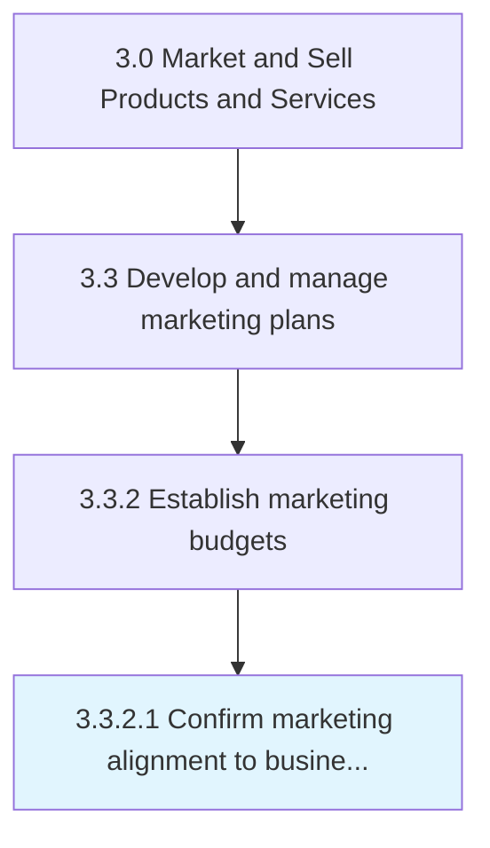
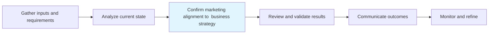

# Confirm marketing alignment to business strategy

> Ensuring corroboration of the marketing strategy and the organizational strategy.

## Overview

Activity 3.3.2.1 is an activity within the Market and Sell Products and Services framework.

Ensuring corroboration of the marketing strategy and the organizational strategy. Ensure the organization's marketing strategy/plan aligns with the overall business strategy. Fine-tune the marketing plan according to the organizational strategy.

This process is critical to effective sales and marketing execution. It ensures that activities are systematically planned, executed, and measured against organizational objectives. When performed effectively, this process drives revenue growth, enhances customer engagement, and strengthens competitive positioning in target markets.

## Process Hierarchy



## Key Statistics

| Metric | Value |
|--------|-------|
| APQC Code | 10155 |
| Hierarchy ID | 3.3.2.1 |
| Level | Activity |
| Parent | [3.3.2](../) |
| Sub-Processes | 0 |

## Process Flow



## GraphDL Semantic Structure

```
confirm.MarketingAlignment.to.BusinessStrategy
```

| Component | Value | Description |
|-----------|-------|-------------|
| Verb | `confirm` | Primary action |
| Object | `marketing alignment` | Direct object |
| Preposition | `to` | Relationship |
| PrepObject | `business strategy` | Indirect object |


## RACI Matrix

| Role | Responsible | Accountable | Consulted | Informed |
|------|:-----------:|:-----------:|:---------:|:--------:|
| Marketing Manager | R |  |  |  |
| CMO / VP Marketing |  | A |  |  |
| Brand Manager |  |  | C |  |
| Sales Manager |  |  | C |  |
| Executive Leadership |  |  |  | I |

## Related Occupations

- [Marketing Managers](/occupations/Management/MarketingManagers)
- [Advertising And Promotions Managers](/occupations/Management/AdvertisingAndPromotionsManagers)
- [Public Relations Specialists](/occupations/Media-and-Communication/PublicRelationsSpecialists)
- [Market Research Analysts](/occupations/Business-and-Financial-Operations/MarketResearchAnalysts)
- [Graphic Designers](/occupations/Arts-Design-Entertainment-Sports-and-Media/GraphicDesigners)

## Related Departments

- [Marketing](/departments/Marketing)
- [Sales](/departments/Sales)
- [Product Management](/departments/ProductManagement)

## Industry Variations

### Retail

In retail, confirm marketing alignment to business strategy emphasizes seasonal promotions, visual merchandising, in-store experience design, and coordinated omnichannel campaigns.

### Automotive

In automotive, confirm marketing alignment to business strategy focuses on dealer network coordination, regional marketing programs, and long purchase-cycle nurture strategies.

### Banking

In banking, confirm marketing alignment to business strategy involves compliance-reviewed communications, branch-level marketing execution, and digital banking promotion strategies.

## KPIs & Metrics

| Metric | Description | Target |
|--------|-------------|--------|
| Campaign ROI | Return on investment for marketing campaigns and promotions | >4:1 |
| Customer Lifetime Value (CLV) | Projected revenue from average customer relationship | >3x CAC |
| Promotion Effectiveness | Incremental revenue generated per promotional dollar spent | >2:1 |
| Budget Utilization | Percentage of marketing budget effectively deployed | >90% |

## Related Concepts

- MarketingAlignment
- BusinessStrategy

---

*Source: APQC PCF 10155 (3.3.2.1) - APQC*
