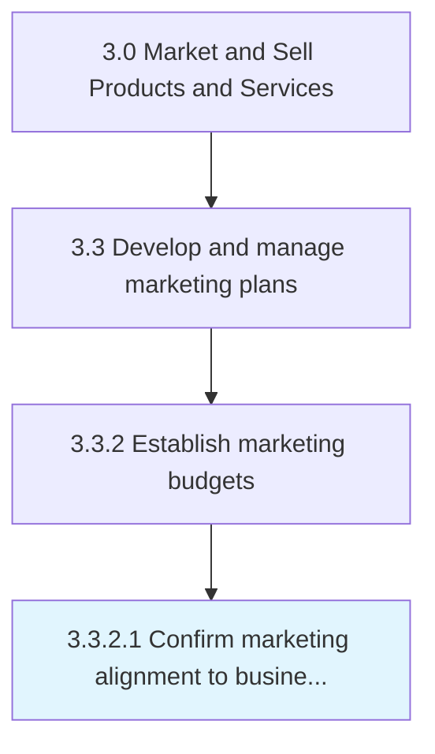

# Confirm marketing alignment to business strategy

> Ensuring corroboration of the marketing strategy and the organizational strategy.

## Overview

Activity 3.3.2.1 is an activity within the Market and Sell Products and Services framework. 

Ensuring corroboration of the marketing strategy and the organizational strategy. Ensure the organization's marketing strategy/plan aligns with the overall business strategy. Fine-tune the marketing plan according to the organizational strategy.

## Process Hierarchy



## Key Statistics

| Metric | Value |
|--------|-------|
| APQC Code | 10155 |
| Hierarchy ID | 3.3.2.1 |
| Level | Activity |
| Parent | [3.3.2](../) |
| Sub-Processes | 0 |


## GraphDL Semantic Structure

```
confirm.MarketingAlignment.to.BusinessStrategy
```

| Component | Value | Description |
|-----------|-------|-------------|
| Verb | `confirm` | Primary action |
| Object | `marketing alignment` | Direct object |
| Preposition | `to` | Relationship |
| PrepObject | `business strategy` | Indirect object |


## Related Concepts

- [MarketingAlignment](/concepts/MarketingAlignment)
- [BusinessStrategy](/concepts/BusinessStrategy)


---

*Source: APQC PCF 10155 (3.3.2.1) - APQC*
