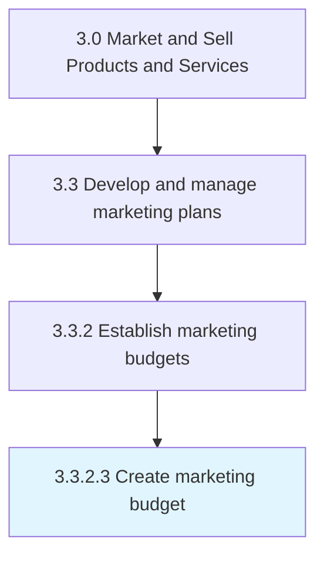

# Create marketing budget

> Estimating the outlay required for promoting, selling, and distributing the products/services of the organization.

## Overview

Activity 3.3.2.3 is an activity within the Market and Sell Products and Services framework. 

Estimating the outlay required for promoting, selling, and distributing the products/services of the organization. Add up the expenses of all activities necessitated in marketing, such as promotional campaigns, advertising, marketing communications, PR campaigns, employing skilled personnel, and office space.

## Process Hierarchy



## Key Statistics

| Metric | Value |
|--------|-------|
| APQC Code | 10157 |
| Hierarchy ID | 3.3.2.3 |
| Level | Activity |
| Parent | [3.3.2](../) |
| Sub-Processes | 0 |


## GraphDL Semantic Structure

```
create.MarketingBudget
```

| Component | Value | Description |
|-----------|-------|-------------|
| Verb | `create` | Primary action |
| Object | `marketing budget` | Direct object |


## Related Concepts

- [MarketingBudget](/concepts/MarketingBudget)


---

*Source: APQC PCF 10157 (3.3.2.3) - APQC*
