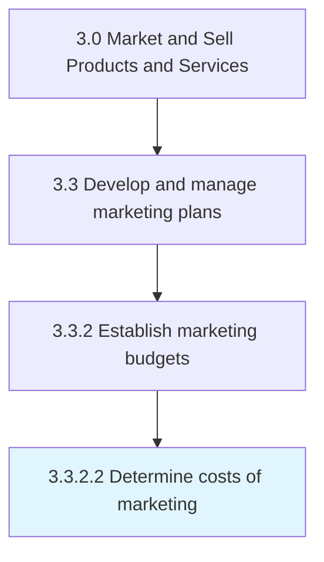

# Determine costs of marketing

> Calculating the total cost of marketing the organization's portfolio of products/services.

## Overview

Activity 3.3.2.2 is an activity within the Market and Sell Products and Services framework. 

Calculating the total cost of marketing the organization's portfolio of products/services. Calculate the total outlay needed for promoting, selling, and delivering the organization's products/services to customers. Account for all costs to acquire customers and sustain a relationship with them. Include the expenses needed for promotional actives, warehousing, transactional costs, and distribution of the organization's offering.

## Process Hierarchy



## Key Statistics

| Metric | Value |
|--------|-------|
| APQC Code | 10156 |
| Hierarchy ID | 3.3.2.2 |
| Level | Activity |
| Parent | [3.3.2](../) |
| Sub-Processes | 0 |


## GraphDL Semantic Structure

```
determine.Costs.of.Marketing
```

| Component | Value | Description |
|-----------|-------|-------------|
| Verb | `determine` | Primary action |
| Object | `costs` | Direct object |
| Preposition | `of` | Relationship |
| PrepObject | `marketing` | Indirect object |


## Related Concepts

- Costs
- Marketing


---

*Source: APQC PCF 10156 (3.3.2.2) - APQC*
