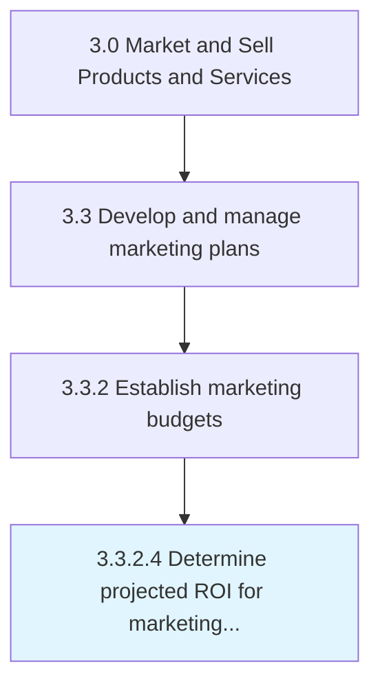

# Determine projected ROI for marketing investment

> Estimating how much profit the company would generate for its expenses on marketing .

## Overview

Activity 3.3.2.4 is an activity within the Market and Sell Products and Services framework. 

Estimating how much profit the company would generate for its expenses on marketing . Forecasted return on investment, used as a metric to gauge the efficiency of marketing, is beneficial in revising marketing budgets and adjusting costs to improve the overall yield.

## Process Hierarchy



## Key Statistics

| Metric | Value |
|--------|-------|
| APQC Code | 17683 |
| Hierarchy ID | 3.3.2.4 |
| Level | Activity |
| Parent | [3.3.2](../) |
| Sub-Processes | 0 |


## GraphDL Semantic Structure

```
determine.ProjectedROI.for.MarketingInvestment
```

| Component | Value | Description |
|-----------|-------|-------------|
| Verb | `determine` | Primary action |
| Object | `projected ROI` | Direct object |
| Preposition | `for` | Relationship |
| PrepObject | `marketing investment` | Indirect object |


## Related Concepts

- [ProjectedROI](/concepts/ProjectedROI)
- [MarketingInvestment](/concepts/MarketingInvestment)


---

*Source: APQC PCF 17683 (3.3.2.4) - APQC*
