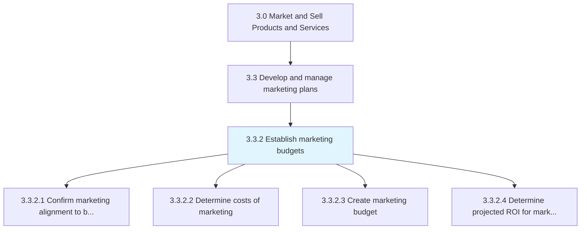
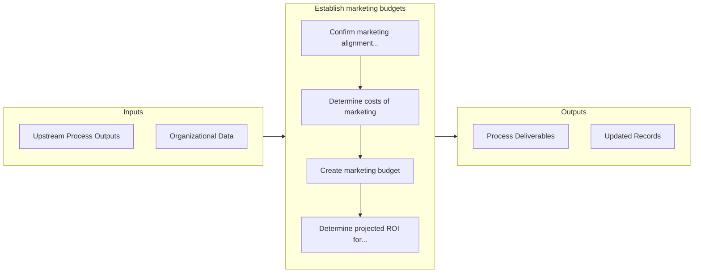

# Establish marketing budgets

> Creating a budget for the organization's marketing efforts, in line with the business-wide strategic outlook.

## Overview

Process 3.3.2 is a core process that defines the specific procedures for establish marketing budgets. 

Creating a budget for the organization's marketing efforts, in line with the business-wide strategic outlook. Create a plan to distribute resources for achieving the marketing strategy in light of the overall business strategy. Make cost assumptions; calculate the estimated total revenue from the marketing activities against the costs/expenses of these activities. Forecast the return on investment. Attribute costs to the appropriate marketing activities such as promotional campaigns, advertising, marketing communications, PR campaigns, personnel, and office space. Enlist the financial and marketing functions.

## Process Hierarchy



## Key Statistics

| Metric | Value |
|--------|-------|
| APQC Code | 10149 |
| Hierarchy ID | 3.3.2 |
| Level | Process |
| Parent | [3.3](../) |
| Sub-Processes | 4 |


## GraphDL Semantic Structure

```
establish.MarketingBudgets
```

| Component | Value | Description |
|-----------|-------|-------------|
| Verb | `establish` | Primary action |
| Object | `marketing budgets` | Direct object |


## Process Flow



## Sub-Processes

| Process | Hierarchy ID | Description |
|---------|-------------|-------------|
| [Confirm marketing alignment to business strategy](./ConfirmMarketingAlignmentToBusinessStrategy) | 3.3.2.1 | Ensuring corroboration of the marketing strategy and the organizational strategy |
| [Determine costs of marketing](./DetermineCostsOfMarketing) | 3.3.2.2 | Calculating the total cost of marketing the organization's portfolio of products/services |
| [Create marketing budget](./CreateMarketingBudget) | 3.3.2.3 | Estimating the outlay required for promoting, selling, and distributing the products/services of the |
| [Determine projected ROI for marketing investment](./DetermineProjectedROIForMarketingInvestment) | 3.3.2.4 | Estimating how much profit the company would generate for its expenses on marketing  |


## Related Concepts

- [MarketingBudgets](/concepts/MarketingBudgets)


---

*Source: APQC PCF 10149 (3.3.2) - APQC*
