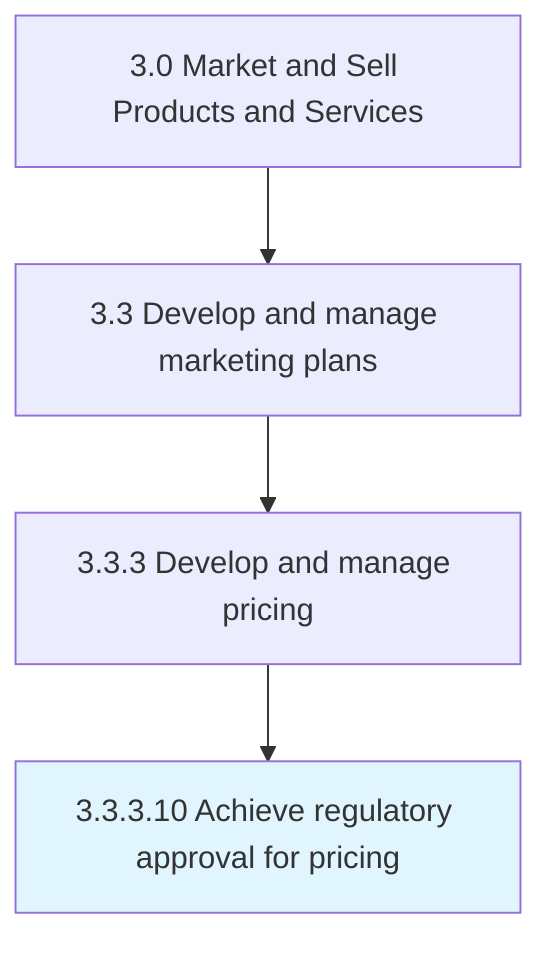

# Achieve regulatory approval for pricing

> Obtaining internal price approvals and governmental approvals that are required for licensed products and for products that can be reimbursed by the government.

## Overview

Activity 3.3.3.10 is an activity within the Market and Sell Products and Services framework. 

Obtaining internal price approvals and governmental approvals that are required for licensed products and for products that can be reimbursed by the government.

## Process Hierarchy



## Key Statistics

| Metric | Value |
|--------|-------|
| APQC Code | 17684 |
| Hierarchy ID | 3.3.3.10 |
| Level | Activity |
| Parent | [3.3.3](../) |
| Sub-Processes | 0 |


## GraphDL Semantic Structure

```
achieve.RegulatoryApproval.for.Pricing
```

| Component | Value | Description |
|-----------|-------|-------------|
| Verb | `achieve` | Primary action |
| Object | `regulatory approval` | Direct object |
| Preposition | `for` | Relationship |
| PrepObject | `pricing` | Indirect object |


## Related Concepts

- [RegulatoryApproval](/concepts/RegulatoryApproval)
- [Pricing](/concepts/Pricing)


---

*Source: APQC PCF 17684 (3.3.3.10) - APQC*
