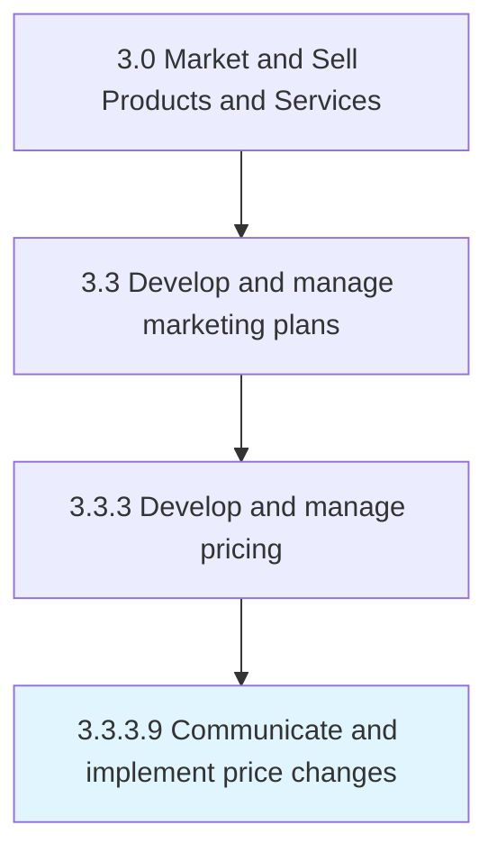

# Communicate and implement price changes

> Assigning new prices or pricing adjustments to products or services to replace the original base prices.

## Overview

Activity 3.3.3.9 is an activity within the Market and Sell Products and Services framework. 

Assigning new prices or pricing adjustments to products or services to replace the original base prices. Update the prices in product catalogs and databases, and disseminate the information through all involved distribution and marketing channels.

## Process Hierarchy



## Key Statistics

| Metric | Value |
|--------|-------|
| APQC Code | 11497 |
| Hierarchy ID | 3.3.3.9 |
| Level | Activity |
| Parent | [3.3.3](../) |
| Sub-Processes | 0 |


## GraphDL Semantic Structure

```
communicate.AndImplementPriceChanges
```

| Component | Value | Description |
|-----------|-------|-------------|
| Verb | `communicate` | Primary action |
| Object | `and implement price changes` | Direct object |


## Related Concepts

- PriceChanges
- PriceChanges


---

*Source: APQC PCF 11497 (3.3.3.9) - APQC*
