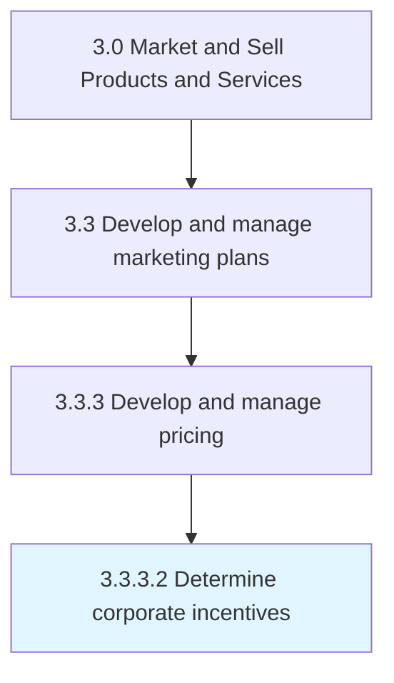

# Determine corporate incentives

> Introducing financial inducements, such as discounts, to distributors, resellers or vendors as a motivation to prioritize selling company's products or services over those of its competitors.

## Overview

Activity 3.3.3.2 is an activity within the Market and Sell Products and Services framework. 

Introducing financial inducements, such as discounts, to distributors, resellers or vendors as a motivation to prioritize selling company's products or services over those of its competitors.

## Process Hierarchy



## Key Statistics

| Metric | Value |
|--------|-------|
| APQC Code | 18948 |
| Hierarchy ID | 3.3.3.2 |
| Level | Activity |
| Parent | [3.3.3](../) |
| Sub-Processes | 0 |


## GraphDL Semantic Structure

```
determine.CorporateIncentives
```

| Component | Value | Description |
|-----------|-------|-------------|
| Verb | `determine` | Primary action |
| Object | `corporate incentives` | Direct object |


## Related Concepts

- [CorporateIncentives](/concepts/CorporateIncentives)


---

*Source: APQC PCF 18948 (3.3.3.2) - APQC*
