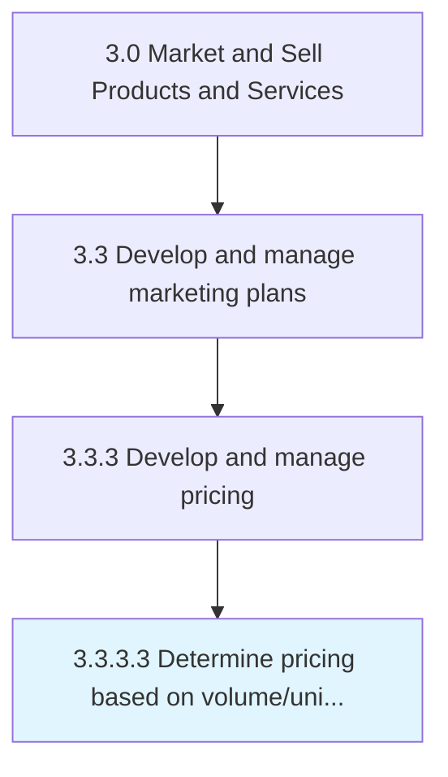

# Determine pricing based on volume/unit forecast

> Establishing a dynamic pricing mechanism for the organization's offerings that is supported by the number of units in production.

## Overview

Activity 3.3.3.3 is an activity within the Market and Sell Products and Services framework.

Establishing a dynamic pricing mechanism for the organization's offerings that is supported by the number of units in production. Outline a system for determining the optimum price point for each product/service. Based this model on an estimation of the volume of anticipated sales for each offering and variable costs.

This process is critical to effective sales and marketing execution. It ensures that activities are systematically planned, executed, and measured against organizational objectives. When performed effectively, this process drives revenue growth, enhances customer engagement, and strengthens competitive positioning in target markets.

## Process Hierarchy



## Key Statistics

| Metric | Value |
|--------|-------|
| APQC Code | 10163 |
| Hierarchy ID | 3.3.3.3 |
| Level | Activity |
| Parent | [3.3.3](../) |
| Sub-Processes | 0 |

## Process Flow


## GraphDL Semantic Structure

```
determine.PricingBased.on.VolumeunitForecast
```

| Component | Value | Description |
|-----------|-------|-------------|
| Verb | `determine` | Primary action |
| Object | `pricing based` | Direct object |
| Preposition | `on` | Relationship |
| PrepObject | `volume/unit forecast` | Indirect object |


## RACI Matrix

| Role | Responsible | Accountable | Consulted | Informed |
|------|:-----------:|:-----------:|:---------:|:--------:|
| Marketing Manager | R |  |  |  |
| CMO / VP Marketing |  | A |  |  |
| Brand Manager |  |  | C |  |
| Sales Manager |  |  | C |  |
| Executive Leadership |  |  |  | I |

## Related Occupations

- [Marketing Managers](/occupations/Management/MarketingManagers)
- [Advertising And Promotions Managers](/occupations/Management/AdvertisingAndPromotionsManagers)
- [Public Relations Specialists](/occupations/Media-and-Communication/PublicRelationsSpecialists)
- [Market Research Analysts](/occupations/Business-and-Financial-Operations/MarketResearchAnalysts)
- [Graphic Designers](/occupations/Arts-Design-Entertainment-Sports-and-Media/GraphicDesigners)

## Related Departments

- [Marketing](/departments/Marketing)
- [Sales](/departments/Sales)
- [Product Management](/departments/ProductManagement)

## Industry Variations

### Retail

In retail, determine pricing based on volume/unit forecast emphasizes seasonal promotions, visual merchandising, in-store experience design, and coordinated omnichannel campaigns.

### Automotive

In automotive, determine pricing based on volume/unit forecast focuses on dealer network coordination, regional marketing programs, and long purchase-cycle nurture strategies.

### Banking

In banking, determine pricing based on volume/unit forecast involves compliance-reviewed communications, branch-level marketing execution, and digital banking promotion strategies.

## KPIs & Metrics

| Metric | Description | Target |
|--------|-------------|--------|
| Campaign ROI | Return on investment for marketing campaigns and promotions | >4:1 |
| Customer Lifetime Value (CLV) | Projected revenue from average customer relationship | >3x CAC |
| Promotion Effectiveness | Incremental revenue generated per promotional dollar spent | >2:1 |
| Budget Utilization | Percentage of marketing budget effectively deployed | >90% |

## Related Concepts

- PricingBased
- VolumeForecast
- PricingBased
- UnitForecast

---

*Source: APQC PCF 10163 (3.3.3.3) - APQC*
