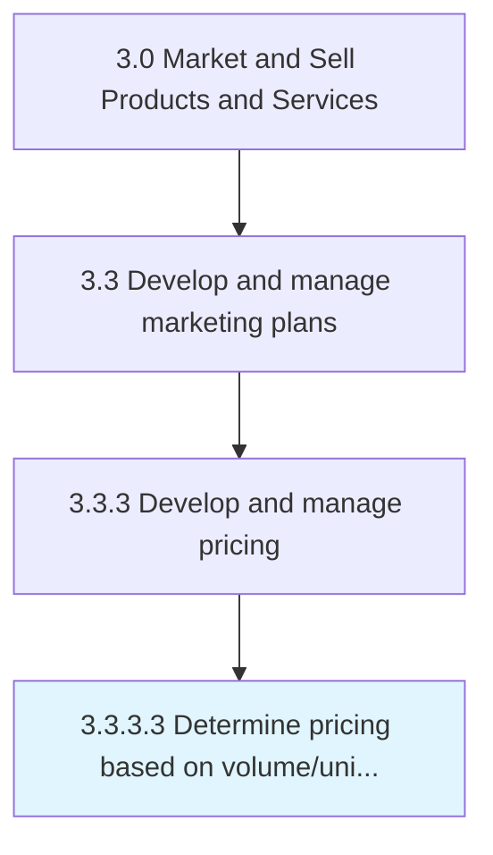

# Determine pricing based on volume/unit forecast

> Establishing a dynamic pricing mechanism for the organization's offerings that is supported by the number of units in production.

## Overview

Activity 3.3.3.3 is an activity within the Market and Sell Products and Services framework. 

Establishing a dynamic pricing mechanism for the organization's offerings that is supported by the number of units in production. Outline a system for determining the optimum price point for each product/service. Based this model on an estimation of the volume of anticipated sales for each offering and variable costs.

## Process Hierarchy



## Key Statistics

| Metric | Value |
|--------|-------|
| APQC Code | 10163 |
| Hierarchy ID | 3.3.3.3 |
| Level | Activity |
| Parent | [3.3.3](../) |
| Sub-Processes | 0 |


## GraphDL Semantic Structure

```
determine.PricingBased.on.VolumeunitForecast
```

| Component | Value | Description |
|-----------|-------|-------------|
| Verb | `determine` | Primary action |
| Object | `pricing based` | Direct object |
| Preposition | `on` | Relationship |
| PrepObject | `volume/unit forecast` | Indirect object |


## Related Concepts

- PricingBased
- VolumeForecast
- PricingBased
- UnitForecast


---

*Source: APQC PCF 10163 (3.3.3.3) - APQC*
