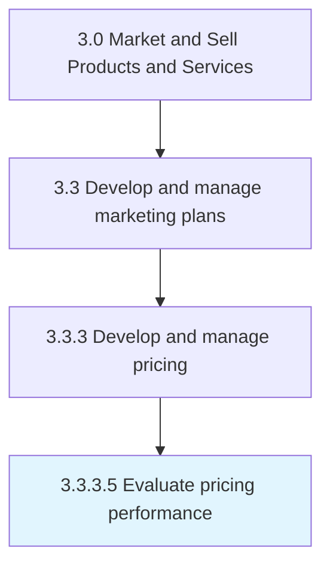
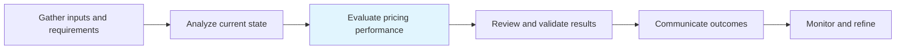

# Evaluate pricing performance

> Examining the efficiency of pricing with the objective of identifying any divergence from the equilibrium prices and avoiding any deadweight loss.

## Overview

Activity 3.3.3.5 is an activity within the Market and Sell Products and Services framework.

Examining the efficiency of pricing with the objective of identifying any divergence from the equilibrium prices and avoiding any deadweight loss. Gauge the performance of the pricing plan by tracking growth in the revenue and/or customer uptake, secured as a result of new prices. Measure the performance of pricing by periodically checking the profits generated from the sale of each of the organization's offerings against the backdrop of any events that may have influenced the uptake of a certain good/service by the customer base.

This process is critical to effective sales and marketing execution. It ensures that activities are systematically planned, executed, and measured against organizational objectives. When performed effectively, this process drives revenue growth, enhances customer engagement, and strengthens competitive positioning in target markets.

## Process Hierarchy



## Key Statistics

| Metric | Value |
|--------|-------|
| APQC Code | 10165 |
| Hierarchy ID | 3.3.3.5 |
| Level | Activity |
| Parent | [3.3.3](../) |
| Sub-Processes | 0 |

## Process Flow



## GraphDL Semantic Structure

```graphdl
evaluate.PricingPerformance
```

| Component | Value | Description |
|-----------|-------|-------------|
| Verb | `evaluate` | Primary action |
| Object | `pricing performance` | Direct object |


## RACI Matrix

| Role | Responsible | Accountable | Consulted | Informed |
|------|:-----------:|:-----------:|:---------:|:--------:|
| Marketing Manager | R |  |  |  |
| CMO / VP Marketing |  | A |  |  |
| Brand Manager |  |  | C |  |
| Sales Manager |  |  | C |  |
| Executive Leadership |  |  |  | I |

## Related Occupations

- [Marketing Managers](/occupations/Management/MarketingManagers)
- [Advertising And Promotions Managers](/occupations/Management/AdvertisingAndPromotionsManagers)
- [Public Relations Specialists](/occupations/Media-and-Communication/PublicRelationsSpecialists)
- [Market Research Analysts](/occupations/Business-and-Financial-Operations/MarketResearchAnalysts)
- [Graphic Designers](/occupations/Arts-Design-Entertainment-Sports-and-Media/GraphicDesigners)

## Related Departments

- [Marketing](/departments/Marketing)
- [Sales](/departments/Sales)
- Product Management

## Industry Variations

### Retail

In retail, evaluate pricing performance emphasizes seasonal promotions, visual merchandising, in-store experience design, and coordinated omnichannel campaigns.

### Automotive

In automotive, evaluate pricing performance focuses on dealer network coordination, regional marketing programs, and long purchase-cycle nurture strategies.

### Banking

In banking, evaluate pricing performance involves compliance-reviewed communications, branch-level marketing execution, and digital banking promotion strategies.

## KPIs & Metrics

| Metric | Description | Target |
|--------|-------------|--------|
| Campaign ROI | Return on investment for marketing campaigns and promotions | >4:1 |
| Customer Lifetime Value (CLV) | Projected revenue from average customer relationship | >3x CAC |
| Promotion Effectiveness | Incremental revenue generated per promotional dollar spent | >2:1 |
| Budget Utilization | Percentage of marketing budget effectively deployed | >90% |

## Related Concepts

- PricingPerformance

---

*Source: APQC PCF 10165 (3.3.3.5) - APQC*
