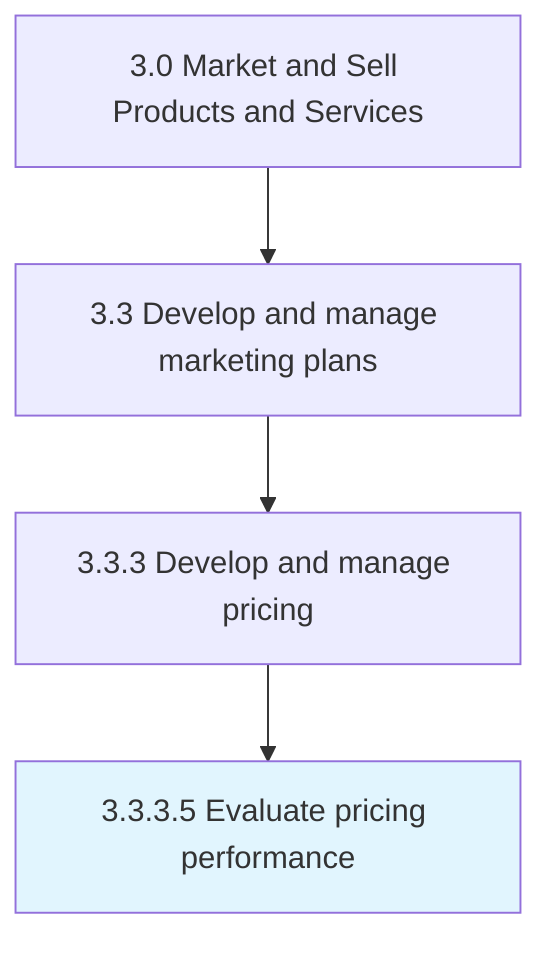

# Evaluate pricing performance

> Examining the efficiency of pricing with the objective of identifying any divergence from the equilibrium prices and avoiding any deadweight loss.

## Overview

Activity 3.3.3.5 is an activity within the Market and Sell Products and Services framework. 

Examining the efficiency of pricing with the objective of identifying any divergence from the equilibrium prices and avoiding any deadweight loss. Gauge the performance of the pricing plan by tracking growth in the revenue and/or customer uptake, secured as a result of new prices. Measure the performance of pricing by periodically checking the profits generated from the sale of each of the organization's offerings against the backdrop of any events that may have influenced the uptake of a certain good/service by the customer base.

## Process Hierarchy



## Key Statistics

| Metric | Value |
|--------|-------|
| APQC Code | 10165 |
| Hierarchy ID | 3.3.3.5 |
| Level | Activity |
| Parent | [3.3.3](../) |
| Sub-Processes | 0 |


## GraphDL Semantic Structure

```
evaluate.PricingPerformance
```

| Component | Value | Description |
|-----------|-------|-------------|
| Verb | `evaluate` | Primary action |
| Object | `pricing performance` | Direct object |


## Related Concepts

- [PricingPerformance](/concepts/PricingPerformance)


---

*Source: APQC PCF 10165 (3.3.3.5) - APQC*
