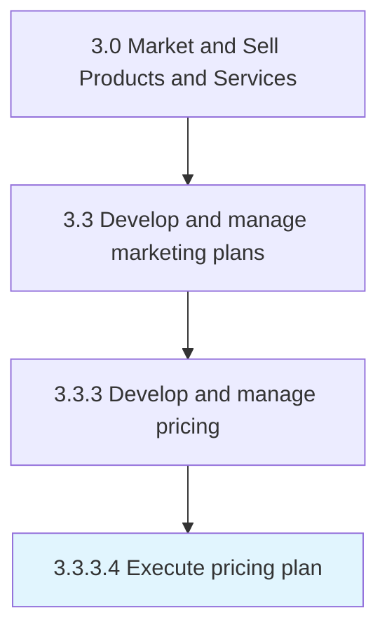

# Execute pricing plan

> Implementing the pricing mechanism to determine prices for all individual offerings in the organizational portfolio.

## Overview

Activity 3.3.3.4 is an activity within the Market and Sell Products and Services framework. 

Implementing the pricing mechanism to determine prices for all individual offerings in the organizational portfolio. Calculate the prices of all offerings based on the established methodology and/or formulaic structure.

## Process Hierarchy



## Key Statistics

| Metric | Value |
|--------|-------|
| APQC Code | 10164 |
| Hierarchy ID | 3.3.3.4 |
| Level | Activity |
| Parent | [3.3.3](../) |
| Sub-Processes | 0 |


## GraphDL Semantic Structure

```
execute.PricingPlan
```

| Component | Value | Description |
|-----------|-------|-------------|
| Verb | `execute` | Primary action |
| Object | `pricing plan` | Direct object |


## Related Concepts

- PricingPlan


---

*Source: APQC PCF 10164 (3.3.3.4) - APQC*
