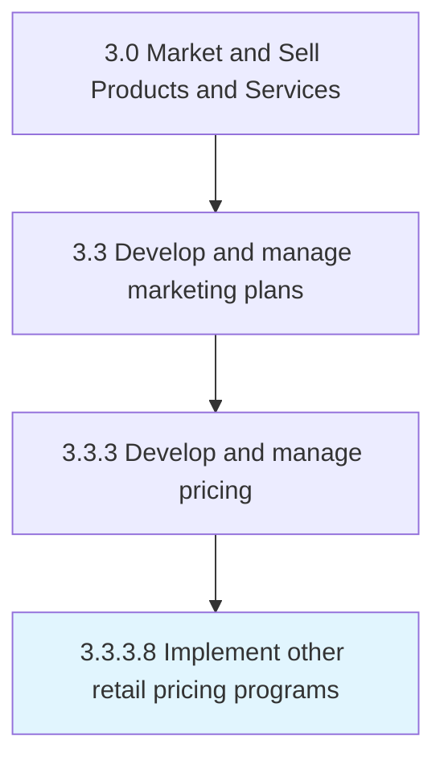

# Implement other retail pricing programs

> Determining the optimum consumer pricing for each product or service at the point of sale, based on production and distribution costs and estimated sales volume.

## Overview

Activity 3.3.3.8 is an activity within the Market and Sell Products and Services framework. 

Determining the optimum consumer pricing for each product or service at the point of sale, based on production and distribution costs and estimated sales volume.

## Process Hierarchy



## Key Statistics

| Metric | Value |
|--------|-------|
| APQC Code | 11496 |
| Hierarchy ID | 3.3.3.8 |
| Level | Activity |
| Parent | [3.3.3](../) |
| Sub-Processes | 0 |


## GraphDL Semantic Structure

```
implement.OtherRetailPricingPrograms
```

| Component | Value | Description |
|-----------|-------|-------------|
| Verb | `implement` | Primary action |
| Object | `other retail pricing programs` | Direct object |


## Related Concepts

- OtherRetailPricingPrograms


---

*Source: APQC PCF 11496 (3.3.3.8) - APQC*
