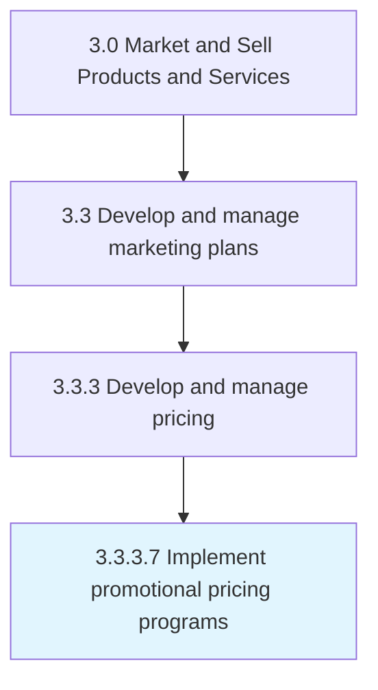

# Implement promotional pricing programs

> Managing schemes that offer lower pricing for a limited time as a promotional and sales incentive when launching a new product or a service.

## Overview

Activity 3.3.3.7 is an activity within the Market and Sell Products and Services framework. 

Managing schemes that offer lower pricing for a limited time as a promotional and sales incentive when launching a new product or a service.

## Process Hierarchy



## Key Statistics

| Metric | Value |
|--------|-------|
| APQC Code | 11495 |
| Hierarchy ID | 3.3.3.7 |
| Level | Activity |
| Parent | [3.3.3](../) |
| Sub-Processes | 0 |


## GraphDL Semantic Structure

```
implement.PromotionalPricingPrograms
```

| Component | Value | Description |
|-----------|-------|-------------|
| Verb | `implement` | Primary action |
| Object | `promotional pricing programs` | Direct object |


## Related Concepts

- [PromotionalPricingPrograms](/concepts/PromotionalPricingPrograms)


---

*Source: APQC PCF 11495 (3.3.3.7) - APQC*
