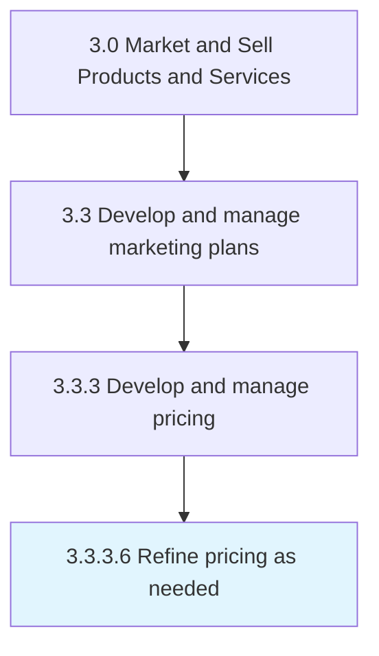

# Refine pricing as needed

> Refining the pricing mechanism to create equitable prices for all products/services with the objective of maximizing the profits and/or customer uptake of these offerings.

## Overview

Activity 3.3.3.6 is an activity within the Market and Sell Products and Services framework. 

Refining the pricing mechanism to create equitable prices for all products/services with the objective of maximizing the profits and/or customer uptake of these offerings. Reconcile the pricing mechanism in order to achieve equilibrium pricing. Adjust the prices for all of the organization's offerings, using the insights gleaned from examining how much profit or customer uptake is generated by the present pricing strategy.

## Process Hierarchy



## Key Statistics

| Metric | Value |
|--------|-------|
| APQC Code | 10166 |
| Hierarchy ID | 3.3.3.6 |
| Level | Activity |
| Parent | [3.3.3](../) |
| Sub-Processes | 0 |


## GraphDL Semantic Structure

```
refine.PricingAsNeeded
```

| Component | Value | Description |
|-----------|-------|-------------|
| Verb | `refine` | Primary action |
| Object | `pricing as needed` | Direct object |


## Related Concepts

- PricingAsNeeded


---

*Source: APQC PCF 10166 (3.3.3.6) - APQC*
