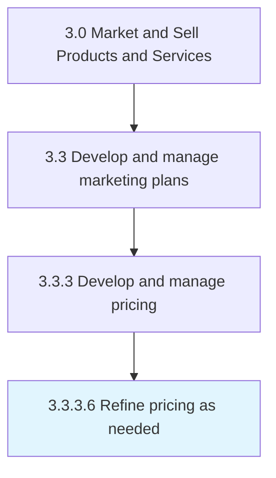
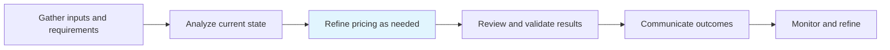

# Refine pricing as needed

> Refining the pricing mechanism to create equitable prices for all products/services with the objective of maximizing the profits and/or customer uptake of these offerings.

## Overview

Activity 3.3.3.6 is an activity within the Market and Sell Products and Services framework.

Refining the pricing mechanism to create equitable prices for all products/services with the objective of maximizing the profits and/or customer uptake of these offerings. Reconcile the pricing mechanism in order to achieve equilibrium pricing. Adjust the prices for all of the organization's offerings, using the insights gleaned from examining how much profit or customer uptake is generated by the present pricing strategy.

This process is critical to effective sales and marketing execution. It ensures that activities are systematically planned, executed, and measured against organizational objectives. When performed effectively, this process drives revenue growth, enhances customer engagement, and strengthens competitive positioning in target markets.

## Process Hierarchy



## Key Statistics

| Metric | Value |
|--------|-------|
| APQC Code | 10166 |
| Hierarchy ID | 3.3.3.6 |
| Level | Activity |
| Parent | [3.3.3](../) |
| Sub-Processes | 0 |

## Process Flow



## GraphDL Semantic Structure

```
refine.PricingAsNeeded
```

| Component | Value | Description |
|-----------|-------|-------------|
| Verb | `refine` | Primary action |
| Object | `pricing as needed` | Direct object |


## RACI Matrix

| Role | Responsible | Accountable | Consulted | Informed |
|------|:-----------:|:-----------:|:---------:|:--------:|
| Marketing Manager | R |  |  |  |
| CMO / VP Marketing |  | A |  |  |
| Brand Manager |  |  | C |  |
| Sales Manager |  |  | C |  |
| Executive Leadership |  |  |  | I |

## Related Occupations

- [Marketing Managers](/occupations/Management/MarketingManagers)
- [Advertising And Promotions Managers](/occupations/Management/AdvertisingAndPromotionsManagers)
- [Public Relations Specialists](/occupations/Media-and-Communication/PublicRelationsSpecialists)
- [Market Research Analysts](/occupations/Business-and-Financial-Operations/MarketResearchAnalysts)
- [Graphic Designers](/occupations/Arts-Design-Entertainment-Sports-and-Media/GraphicDesigners)

## Related Departments

- [Marketing](/departments/Marketing)
- [Sales](/departments/Sales)
- [Product Management](/departments/ProductManagement)

## Industry Variations

### Retail

In retail, refine pricing as needed emphasizes seasonal promotions, visual merchandising, in-store experience design, and coordinated omnichannel campaigns.

### Automotive

In automotive, refine pricing as needed focuses on dealer network coordination, regional marketing programs, and long purchase-cycle nurture strategies.

### Banking

In banking, refine pricing as needed involves compliance-reviewed communications, branch-level marketing execution, and digital banking promotion strategies.

## KPIs & Metrics

| Metric | Description | Target |
|--------|-------------|--------|
| Campaign ROI | Return on investment for marketing campaigns and promotions | >4:1 |
| Customer Lifetime Value (CLV) | Projected revenue from average customer relationship | >3x CAC |
| Promotion Effectiveness | Incremental revenue generated per promotional dollar spent | >2:1 |
| Budget Utilization | Percentage of marketing budget effectively deployed | >90% |

## Related Concepts

- PricingAsNeeded

---

*Source: APQC PCF 10166 (3.3.3.6) - APQC*
