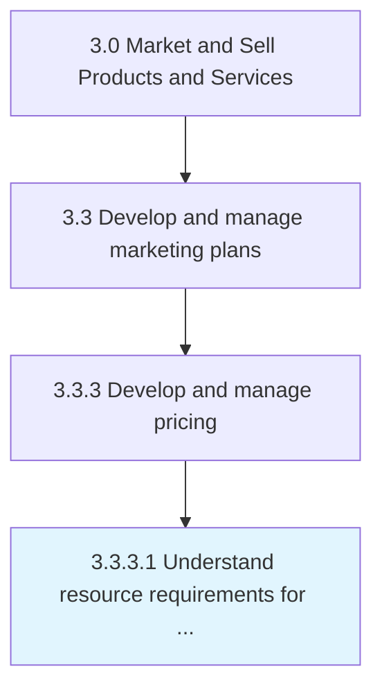
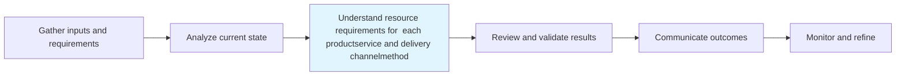

# Understand resource requirements for each product/service and delivery channel/method

> Determining the production and distribution costs for each product or service, and each channel or method as factors in determining overall pricing.

## Overview

Activity 3.3.3.1 is an activity within the Market and Sell Products and Services framework.

Determining the production and distribution costs for each product or service, and each channel or method as factors in determining overall pricing.

This process is critical to effective sales and marketing execution. It ensures that activities are systematically planned, executed, and measured against organizational objectives. When performed effectively, this process drives revenue growth, enhances customer engagement, and strengthens competitive positioning in target markets.

## Process Hierarchy



## Key Statistics

| Metric | Value |
|--------|-------|
| APQC Code | 20009 |
| Hierarchy ID | 3.3.3.1 |
| Level | Activity |
| Parent | [3.3.3](../) |
| Sub-Processes | 0 |

## Process Flow



## GraphDL Semantic Structure

```
understand.ResourceRequirements.for.EachProductserviceAndDeliveryChannelmethod
```

| Component | Value | Description |
|-----------|-------|-------------|
| Verb | `understand` | Primary action |
| Object | `resource requirements` | Direct object |
| Preposition | `for` | Relationship |
| PrepObject | `each product/service and delivery channel/method` | Indirect object |


## RACI Matrix

| Role | Responsible | Accountable | Consulted | Informed |
|------|:-----------:|:-----------:|:---------:|:--------:|
| Marketing Manager | R |  |  |  |
| CMO / VP Marketing |  | A |  |  |
| Brand Manager |  |  | C |  |
| Sales Manager |  |  | C |  |
| Executive Leadership |  |  |  | I |

## Related Occupations

- [Marketing Managers](/occupations/Management/MarketingManagers)
- [Advertising And Promotions Managers](/occupations/Management/AdvertisingAndPromotionsManagers)
- [Public Relations Specialists](/occupations/Media-and-Communication/PublicRelationsSpecialists)
- [Market Research Analysts](/occupations/Business-and-Financial-Operations/MarketResearchAnalysts)
- [Graphic Designers](/occupations/Arts-Design-Entertainment-Sports-and-Media/GraphicDesigners)

## Related Departments

- [Marketing](/departments/Marketing)
- [Sales](/departments/Sales)
- [Product Management](/departments/ProductManagement)

## Industry Variations

### Retail

In retail, understand resource requirements for each product/service and delivery channel/method emphasizes seasonal promotions, visual merchandising, in-store experience design, and coordinated omnichannel campaigns.

### Automotive

In automotive, understand resource requirements for each product/service and delivery channel/method focuses on dealer network coordination, regional marketing programs, and long purchase-cycle nurture strategies.

### Banking

In banking, understand resource requirements for each product/service and delivery channel/method involves compliance-reviewed communications, branch-level marketing execution, and digital banking promotion strategies.

## KPIs & Metrics

| Metric | Description | Target |
|--------|-------------|--------|
| Campaign ROI | Return on investment for marketing campaigns and promotions | >4:1 |
| Customer Lifetime Value (CLV) | Projected revenue from average customer relationship | >3x CAC |
| Promotion Effectiveness | Incremental revenue generated per promotional dollar spent | >2:1 |
| Budget Utilization | Percentage of marketing budget effectively deployed | >90% |

## Related Concepts

- ResourceRequirements
- ProductChannel/Method
- ResourceRequirements
- ServiceChannel/Method
- ResourceRequirements
- DeliveryChannel/Method

---

*Source: APQC PCF 20009 (3.3.3.1) - APQC*
