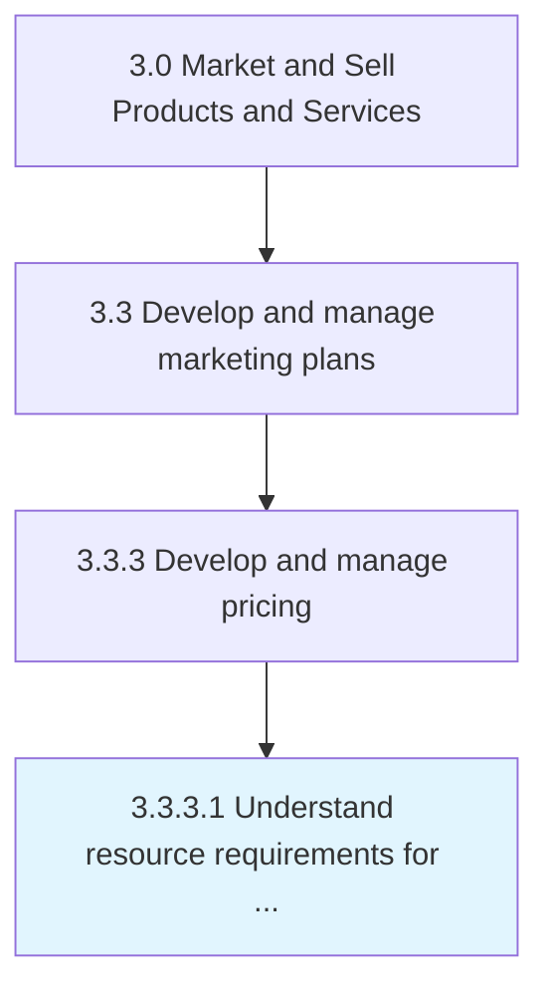

# Understand resource requirements for each product/service and delivery channel/method

> Determining the production and distribution costs for each product or service, and each channel or method as factors in determining overall pricing.

## Overview

Activity 3.3.3.1 is an activity within the Market and Sell Products and Services framework. 

Determining the production and distribution costs for each product or service, and each channel or method as factors in determining overall pricing.

## Process Hierarchy



## Key Statistics

| Metric | Value |
|--------|-------|
| APQC Code | 20009 |
| Hierarchy ID | 3.3.3.1 |
| Level | Activity |
| Parent | [3.3.3](../) |
| Sub-Processes | 0 |


## GraphDL Semantic Structure

```
understand.ResourceRequirements.for.EachProductserviceAndDeliveryChannelmethod
```

| Component | Value | Description |
|-----------|-------|-------------|
| Verb | `understand` | Primary action |
| Object | `resource requirements` | Direct object |
| Preposition | `for` | Relationship |
| PrepObject | `each product/service and delivery channel/method` | Indirect object |


## Related Concepts

- [ResourceRequirements](/concepts/ResourceRequirements)
- [ProductChannel/Method](/concepts/ProductChannel/Method)
- [ResourceRequirements](/concepts/ResourceRequirements)
- [ServiceChannel/Method](/concepts/ServiceChannel/Method)
- [ResourceRequirements](/concepts/ResourceRequirements)
- [DeliveryChannel/Method](/concepts/DeliveryChannel/Method)


---

*Source: APQC PCF 20009 (3.3.3.1) - APQC*
