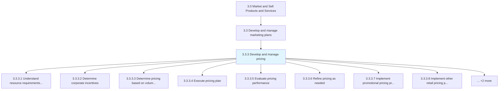
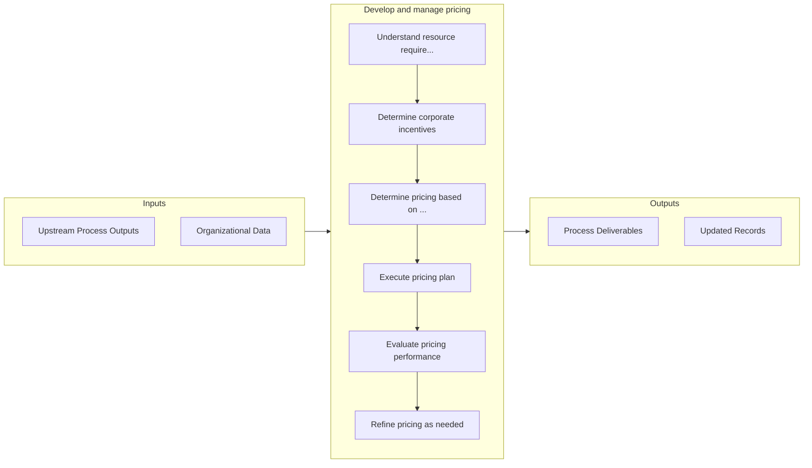

# Develop and manage pricing

> Determining and maintaining a pricing mechanism based on forecasted sales and that enables a pricing equilibrium for the lifecycles of products/services.

## Overview

Process 3.3.3 is a core process that defines the specific procedures for develop and manage pricing. 

Determining and maintaining a pricing mechanism based on forecasted sales and that enables a pricing equilibrium for the lifecycles of products/services. Create a pricing mechanism, factoring in attributes relating to the market, customers, sales, and the cost of production. Implement this pricing mechanism over all products/services. Analyze its performance, and adjust accordingly.

## Process Hierarchy



## Key Statistics

| Metric | Value |
|--------|-------|
| APQC Code | 20593 |
| Hierarchy ID | 3.3.3 |
| Level | Process |
| Parent | [3.3](../) |
| Sub-Processes | 10 |


## GraphDL Semantic Structure

```graphdl
develop.AndManagePricing
```

| Component | Value | Description |
|-----------|-------|-------------|
| Verb | `develop` | Primary action |
| Object | `and manage pricing` | Direct object |


## Process Flow



## Sub-Processes

| Process | Hierarchy ID | Description |
|---------|-------------|-------------|
| [Understand resource requirements for each product/service and delivery channel/method](./UnderstandResourceRequirementsForEachProductserviceAndDeliveryChannelmethod) | 3.3.3.1 | Determining the production and distribution costs for each product or service, and each channel or m |
| [Determine corporate incentives](./DetermineCorporateIncentives) | 3.3.3.2 | Introducing financial inducements, such as discounts, to distributors, resellers or vendors as a mot |
| [Determine pricing based on volume/unit forecast](./DeterminePricingBasedOnVolumeunitForecast) | 3.3.3.3 | Establishing a dynamic pricing mechanism for the organization's offerings that is supported by the n |
| [Execute pricing plan](./ExecutePricingPlan) | 3.3.3.4 | Implementing the pricing mechanism to determine prices for all individual offerings in the organizat |
| [Evaluate pricing performance](./EvaluatePricingPerformance) | 3.3.3.5 | Examining the efficiency of pricing with the objective of identifying any divergence from the equili |
| [Refine pricing as needed](./RefinePricingAsNeeded) | 3.3.3.6 | Refining the pricing mechanism to create equitable prices for all products/services with the objecti |
| [Implement promotional pricing programs](./ImplementPromotionalPricingPrograms) | 3.3.3.7 | Managing schemes that offer lower pricing for a limited time as a promotional and sales incentive wh |
| [Implement other retail pricing programs](./ImplementOtherRetailPricingPrograms) | 3.3.3.8 | Determining the optimum consumer pricing for each product or service at the point of sale, based on  |
| [Communicate and implement price changes](./CommunicateAndImplementPriceChanges) | 3.3.3.9 | Assigning new prices or pricing adjustments to products or services to replace the original base pri |
| [Achieve regulatory approval for pricing](./AchieveRegulatoryApprovalForPricing) | 3.3.3.10 | Obtaining internal price approvals and governmental approvals that are required for licensed product |


## Related Concepts

- Pricing
- Pricing


---

*Source: APQC PCF 20593 (3.3.3) - APQC*
