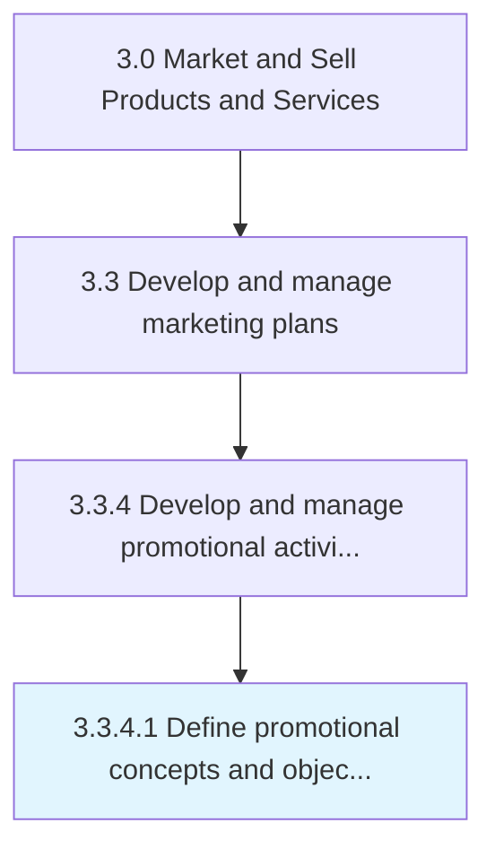

# Define promotional concepts and objectives

> Outlining a conceptual framework for all promotional activity in order to create an overarching aspiration and ensure consistency.

## Overview

Activity 3.3.4.1 is an activity within the Market and Sell Products and Services framework. 

Outlining a conceptual framework for all promotional activity in order to create an overarching aspiration and ensure consistency. Create a plan for running promotional programs and designing the associated activities in order to increase visibility or sales. Determine how the organization quantifies what it wishes to achieve from these activities, what sort of messages the organization comfortable publicizing, what channels the organization wishes to employ, etc.

## Process Hierarchy



## Key Statistics

| Metric | Value |
|--------|-------|
| APQC Code | 10167 |
| Hierarchy ID | 3.3.4.1 |
| Level | Activity |
| Parent | [3.3.4](../) |
| Sub-Processes | 0 |


## GraphDL Semantic Structure

```
define.PromotionalConceptsAndObjectives
```

| Component | Value | Description |
|-----------|-------|-------------|
| Verb | `define` | Primary action |
| Object | `promotional concepts and objectives` | Direct object |


## Related Concepts

- [PromotionalConcepts](/concepts/PromotionalConcepts)
- [Objectives](/concepts/Objectives)


---

*Source: APQC PCF 10167 (3.3.4.1) - APQC*
