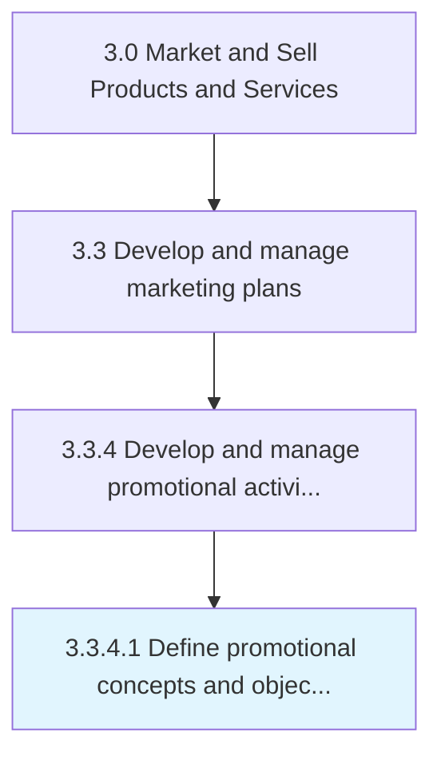
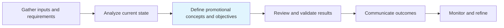

# Define promotional concepts and objectives

> Outlining a conceptual framework for all promotional activity in order to create an overarching aspiration and ensure consistency.

## Overview

Activity 3.3.4.1 is an activity within the Market and Sell Products and Services framework.

Outlining a conceptual framework for all promotional activity in order to create an overarching aspiration and ensure consistency. Create a plan for running promotional programs and designing the associated activities in order to increase visibility or sales. Determine how the organization quantifies what it wishes to achieve from these activities, what sort of messages the organization comfortable publicizing, what channels the organization wishes to employ, etc.

This process is critical to effective sales and marketing execution. It ensures that activities are systematically planned, executed, and measured against organizational objectives. When performed effectively, this process drives revenue growth, enhances customer engagement, and strengthens competitive positioning in target markets.

## Process Hierarchy



## Key Statistics

| Metric | Value |
|--------|-------|
| APQC Code | 10167 |
| Hierarchy ID | 3.3.4.1 |
| Level | Activity |
| Parent | [3.3.4](../) |
| Sub-Processes | 0 |

## Process Flow



## GraphDL Semantic Structure

```
define.PromotionalConceptsAndObjectives
```

| Component | Value | Description |
|-----------|-------|-------------|
| Verb | `define` | Primary action |
| Object | `promotional concepts and objectives` | Direct object |


## RACI Matrix

| Role | Responsible | Accountable | Consulted | Informed |
|------|:-----------:|:-----------:|:---------:|:--------:|
| Marketing Manager | R |  |  |  |
| CMO / VP Marketing |  | A |  |  |
| Brand Manager |  |  | C |  |
| Sales Manager |  |  | C |  |
| Executive Leadership |  |  |  | I |

## Related Occupations

- [Marketing Managers](/occupations/Management/MarketingManagers)
- [Advertising And Promotions Managers](/occupations/Management/AdvertisingAndPromotionsManagers)
- [Public Relations Specialists](/occupations/Media-and-Communication/PublicRelationsSpecialists)
- [Market Research Analysts](/occupations/Business-and-Financial-Operations/MarketResearchAnalysts)
- [Graphic Designers](/occupations/Arts-Design-Entertainment-Sports-and-Media/GraphicDesigners)

## Related Departments

- [Marketing](/departments/Marketing)
- [Sales](/departments/Sales)
- [Product Management](/departments/ProductManagement)

## Industry Variations

### Retail

In retail, define promotional concepts and objectives emphasizes seasonal promotions, visual merchandising, in-store experience design, and coordinated omnichannel campaigns.

### Automotive

In automotive, define promotional concepts and objectives focuses on dealer network coordination, regional marketing programs, and long purchase-cycle nurture strategies.

### Banking

In banking, define promotional concepts and objectives involves compliance-reviewed communications, branch-level marketing execution, and digital banking promotion strategies.

## KPIs & Metrics

| Metric | Description | Target |
|--------|-------------|--------|
| Campaign ROI | Return on investment for marketing campaigns and promotions | >4:1 |
| Customer Lifetime Value (CLV) | Projected revenue from average customer relationship | >3x CAC |
| Promotion Effectiveness | Incremental revenue generated per promotional dollar spent | >2:1 |
| Budget Utilization | Percentage of marketing budget effectively deployed | >90% |

## Related Concepts

- PromotionalConcepts
- Objectives

---

*Source: APQC PCF 10167 (3.3.4.1) - APQC*
