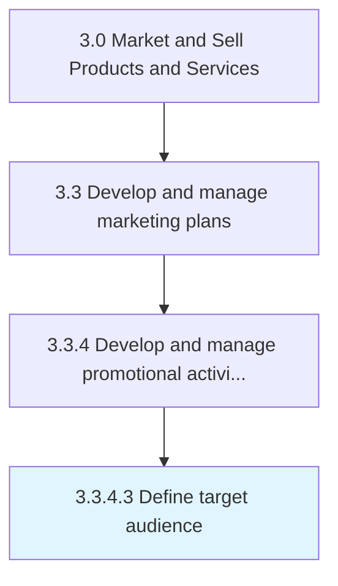

# Define target audience

> Determining the appropriate audience to direct marketing efforts at.

## Overview

Activity 3.3.4.3 is an activity within the Market and Sell Products and Services framework. 

Determining the appropriate audience to direct marketing efforts at. Identify the particular group of customers to target. Discover the appropriate customer groups at a micro-level. Use techniques such as segmentation analysis, whereby the entire population is sliced according to certain demographic or behavioral attributes.

## Process Hierarchy



## Key Statistics

| Metric | Value |
|--------|-------|
| APQC Code | 10160 |
| Hierarchy ID | 3.3.4.3 |
| Level | Activity |
| Parent | [3.3.4](../) |
| Sub-Processes | 0 |


## GraphDL Semantic Structure

```
define.TargetAudience
```

| Component | Value | Description |
|-----------|-------|-------------|
| Verb | `define` | Primary action |
| Object | `target audience` | Direct object |


## Related Concepts

- TargetAudience


---

*Source: APQC PCF 10160 (3.3.4.3) - APQC*
