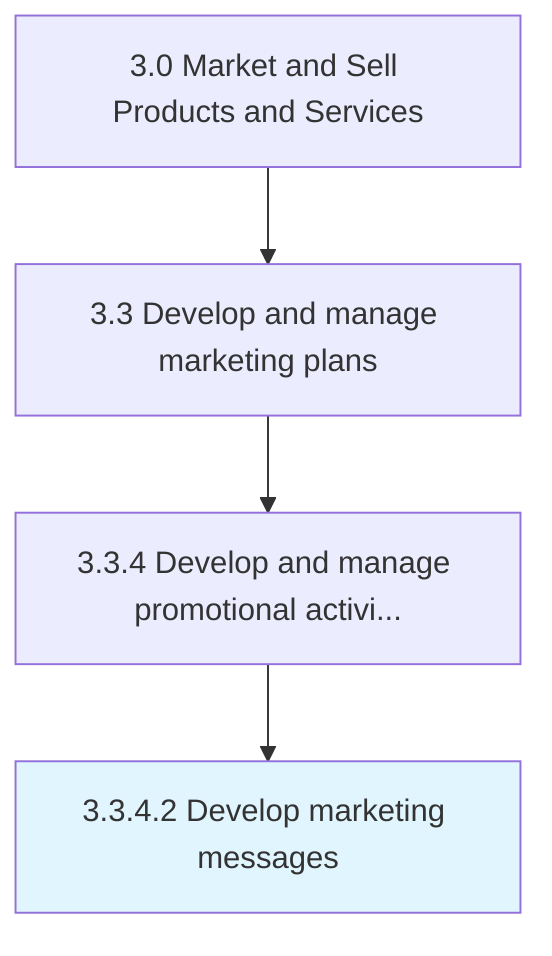

# Develop marketing messages

> Developing the central messages for a segment of its customers.

## Overview

Activity 3.3.4.2 is an activity within the Market and Sell Products and Services framework. 

Developing the central messages for a segment of its customers. Craft concise statements that position the value proposition of individual products/services around the pressing concerns in the market, thereby showing how the organization's offerings are the right fit for the customers.

## Process Hierarchy



## Key Statistics

| Metric | Value |
|--------|-------|
| APQC Code | 10159 |
| Hierarchy ID | 3.3.4.2 |
| Level | Activity |
| Parent | [3.3.4](../) |
| Sub-Processes | 0 |


## GraphDL Semantic Structure

```
develop.MarketingMessages
```

| Component | Value | Description |
|-----------|-------|-------------|
| Verb | `develop` | Primary action |
| Object | `marketing messages` | Direct object |


## Related Concepts

- [MarketingMessages](/concepts/MarketingMessages)


---

*Source: APQC PCF 10159 (3.3.4.2) - APQC*
