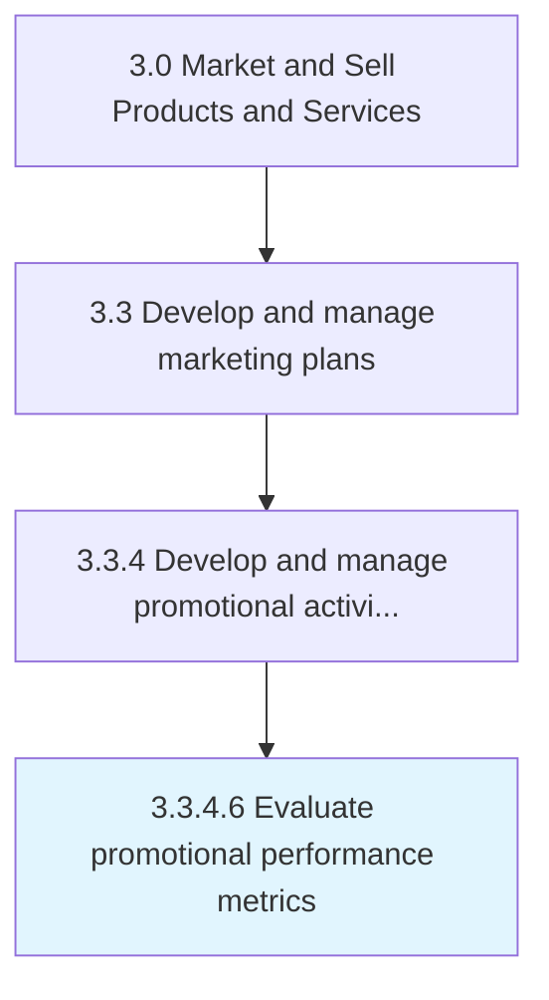

# Evaluate promotional performance metrics

> Evaluating the success of promotional programs through metrics that track the impact of these activities.

## Overview

Activity 3.3.4.6 is an activity within the Market and Sell Products and Services framework.

Evaluating the success of promotional programs through metrics that track the impact of these activities. Examine the performance of promotional activities. Measure the success of these programs through metrics representative of customer uptake, market penetration, sustenance of impact created, revenue growth through offerings marketed, etc. Measure through primary data collection. Analyze through various statistical techniques to generate insights.

This process is critical to effective sales and marketing execution. It ensures that activities are systematically planned, executed, and measured against organizational objectives. When performed effectively, this process drives revenue growth, enhances customer engagement, and strengthens competitive positioning in target markets.

## Process Hierarchy



## Key Statistics

| Metric | Value |
|--------|-------|
| APQC Code | 10170 |
| Hierarchy ID | 3.3.4.6 |
| Level | Activity |
| Parent | [3.3.4](../) |
| Sub-Processes | 0 |

## Process Flow


## GraphDL Semantic Structure

```graphdl
evaluate.PromotionalPerformanceMetrics
```

| Component | Value | Description |
|-----------|-------|-------------|
| Verb | `evaluate` | Primary action |
| Object | `promotional performance metrics` | Direct object |


## RACI Matrix

| Role | Responsible | Accountable | Consulted | Informed |
|------|:-----------:|:-----------:|:---------:|:--------:|
| Marketing Manager | R |  |  |  |
| CMO / VP Marketing |  | A |  |  |
| Brand Manager |  |  | C |  |
| Sales Manager |  |  | C |  |
| Executive Leadership |  |  |  | I |

## Related Occupations

- [Marketing Managers](/occupations/Management/MarketingManagers)
- [Advertising And Promotions Managers](/occupations/Management/AdvertisingAndPromotionsManagers)
- [Public Relations Specialists](/occupations/Media-and-Communication/PublicRelationsSpecialists)
- [Market Research Analysts](/occupations/Business-and-Financial-Operations/MarketResearchAnalysts)
- [Graphic Designers](/occupations/Arts-Design-Entertainment-Sports-and-Media/GraphicDesigners)

## Related Departments

- [Marketing](/departments/Marketing)
- [Sales](/departments/Sales)
- Product Management

## Industry Variations

### Retail

In retail, evaluate promotional performance metrics emphasizes seasonal promotions, visual merchandising, in-store experience design, and coordinated omnichannel campaigns.

### Automotive

In automotive, evaluate promotional performance metrics focuses on dealer network coordination, regional marketing programs, and long purchase-cycle nurture strategies.

### Banking

In banking, evaluate promotional performance metrics involves compliance-reviewed communications, branch-level marketing execution, and digital banking promotion strategies.

## KPIs & Metrics

| Metric | Description | Target |
|--------|-------------|--------|
| Campaign ROI | Return on investment for marketing campaigns and promotions | >4:1 |
| Customer Lifetime Value (CLV) | Projected revenue from average customer relationship | >3x CAC |
| Promotion Effectiveness | Incremental revenue generated per promotional dollar spent | >2:1 |
| Budget Utilization | Percentage of marketing budget effectively deployed | >90% |

## Related Concepts

- PromotionalPerformanceMetrics

---

*Source: APQC PCF 10170 (3.3.4.6) - APQC*
