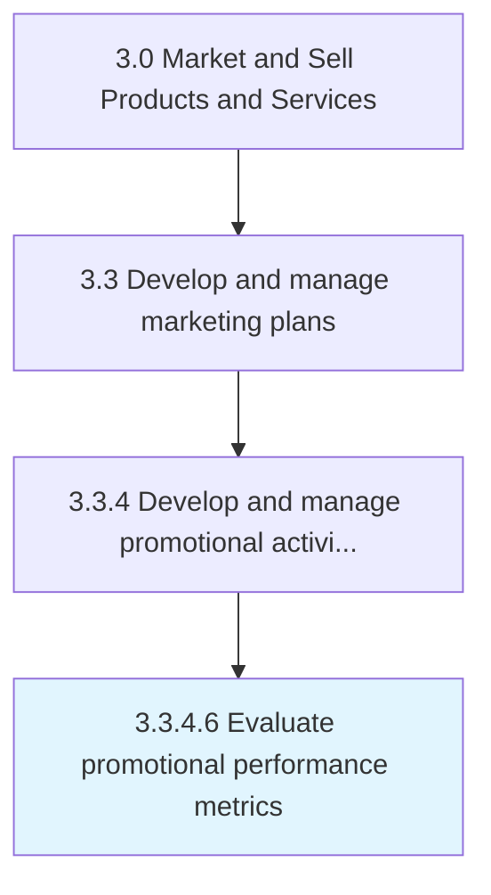

# Evaluate promotional performance metrics

> Evaluating the success of promotional programs through metrics that track the impact of these activities.

## Overview

Activity 3.3.4.6 is an activity within the Market and Sell Products and Services framework. 

Evaluating the success of promotional programs through metrics that track the impact of these activities. Examine the performance of promotional activities. Measure the success of these programs through metrics representative of customer uptake, market penetration, sustenance of impact created, revenue growth through offerings marketed, etc. Measure through primary data collection. Analyze through various statistical techniques to generate insights.

## Process Hierarchy



## Key Statistics

| Metric | Value |
|--------|-------|
| APQC Code | 10170 |
| Hierarchy ID | 3.3.4.6 |
| Level | Activity |
| Parent | [3.3.4](../) |
| Sub-Processes | 0 |


## GraphDL Semantic Structure

```
evaluate.PromotionalPerformanceMetrics
```

| Component | Value | Description |
|-----------|-------|-------------|
| Verb | `evaluate` | Primary action |
| Object | `promotional performance metrics` | Direct object |


## Related Concepts

- PromotionalPerformanceMetrics


---

*Source: APQC PCF 10170 (3.3.4.6) - APQC*
