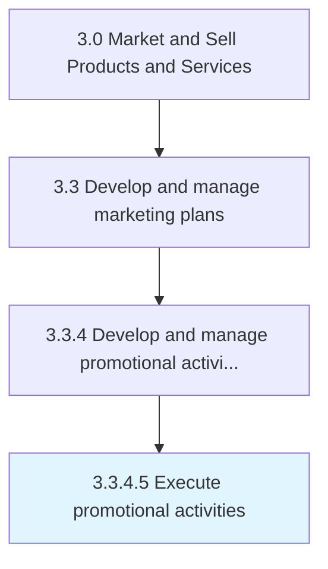
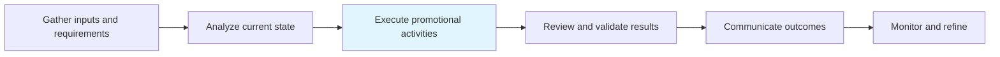

# Execute promotional activities

> Executing promotional programs in the market for reaching out to the desired customer segments.

## Overview

Activity 3.3.4.5 is an activity within the Market and Sell Products and Services framework.

Executing promotional programs in the market for reaching out to the desired customer segments. Implement the promotional schemes and campaigns. Create collaterals for the dissemination of information about the product, product line, brand, or company to the target audiences in an effective manner. Leverage relationships with distributors, vendors, and retailers. Consider enlisting professional services such as design, PR, and advertising firms.

This process is critical to effective sales and marketing execution. It ensures that activities are systematically planned, executed, and measured against organizational objectives. When performed effectively, this process drives revenue growth, enhances customer engagement, and strengthens competitive positioning in target markets.

## Process Hierarchy



## Key Statistics

| Metric | Value |
|--------|-------|
| APQC Code | 10169 |
| Hierarchy ID | 3.3.4.5 |
| Level | Activity |
| Parent | [3.3.4](../) |
| Sub-Processes | 0 |

## Process Flow



## GraphDL Semantic Structure

```graphdl
execute.PromotionalActivities
```

| Component | Value | Description |
|-----------|-------|-------------|
| Verb | `execute` | Primary action |
| Object | `promotional activities` | Direct object |


## RACI Matrix

| Role | Responsible | Accountable | Consulted | Informed |
|------|:-----------:|:-----------:|:---------:|:--------:|
| Marketing Manager | R |  |  |  |
| CMO / VP Marketing |  | A |  |  |
| Brand Manager |  |  | C |  |
| Sales Manager |  |  | C |  |
| Executive Leadership |  |  |  | I |

## Related Occupations

- [Marketing Managers](/occupations/Management/MarketingManagers)
- [Advertising And Promotions Managers](/occupations/Management/AdvertisingAndPromotionsManagers)
- [Public Relations Specialists](/occupations/Media-and-Communication/PublicRelationsSpecialists)
- [Market Research Analysts](/occupations/Business-and-Financial-Operations/MarketResearchAnalysts)
- [Graphic Designers](/occupations/Arts-Design-Entertainment-Sports-and-Media/GraphicDesigners)

## Related Departments

- [Marketing](/departments/Marketing)
- [Sales](/departments/Sales)
- Product Management

## Industry Variations

### Retail

In retail, execute promotional activities emphasizes seasonal promotions, visual merchandising, in-store experience design, and coordinated omnichannel campaigns.

### Automotive

In automotive, execute promotional activities focuses on dealer network coordination, regional marketing programs, and long purchase-cycle nurture strategies.

### Banking

In banking, execute promotional activities involves compliance-reviewed communications, branch-level marketing execution, and digital banking promotion strategies.

## KPIs & Metrics

| Metric | Description | Target |
|--------|-------------|--------|
| Campaign ROI | Return on investment for marketing campaigns and promotions | >4:1 |
| Customer Lifetime Value (CLV) | Projected revenue from average customer relationship | >3x CAC |
| Promotion Effectiveness | Incremental revenue generated per promotional dollar spent | >2:1 |
| Budget Utilization | Percentage of marketing budget effectively deployed | >90% |

## Related Concepts

- PromotionalActivities

---

*Source: APQC PCF 10169 (3.3.4.5) - APQC*
