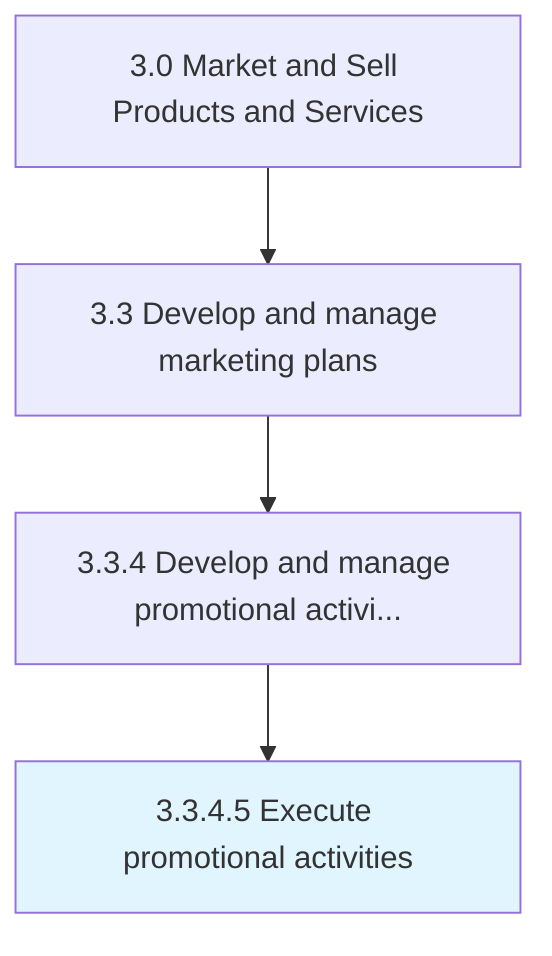

# Execute promotional activities

> Executing promotional programs in the market for reaching out to the desired customer segments.

## Overview

Activity 3.3.4.5 is an activity within the Market and Sell Products and Services framework. 

Executing promotional programs in the market for reaching out to the desired customer segments. Implement the promotional schemes and campaigns. Create collaterals for the dissemination of information about the product, product line, brand, or company to the target audiences in an effective manner. Leverage relationships with distributors, vendors, and retailers. Consider enlisting professional services such as design, PR, and advertising firms.

## Process Hierarchy



## Key Statistics

| Metric | Value |
|--------|-------|
| APQC Code | 10169 |
| Hierarchy ID | 3.3.4.5 |
| Level | Activity |
| Parent | [3.3.4](../) |
| Sub-Processes | 0 |


## GraphDL Semantic Structure

```
execute.PromotionalActivities
```

| Component | Value | Description |
|-----------|-------|-------------|
| Verb | `execute` | Primary action |
| Object | `promotional activities` | Direct object |


## Related Concepts

- [PromotionalActivities](/concepts/PromotionalActivities)


---

*Source: APQC PCF 10169 (3.3.4.5) - APQC*
