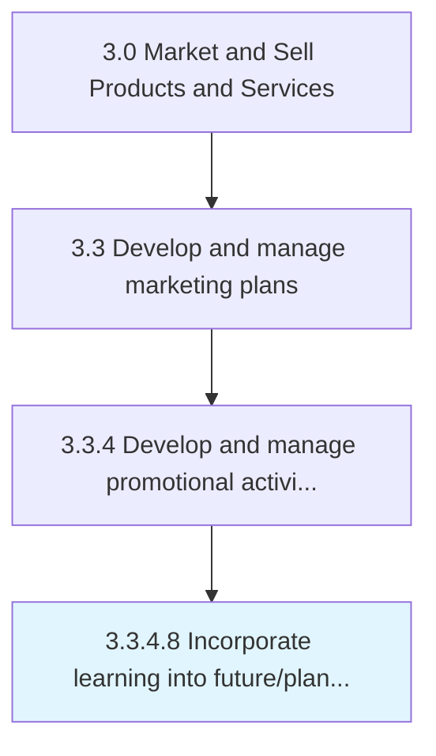

# Incorporate learning into future/planned consumer promotions

> Incorporating the understanding developed by studying promotional activities as well as refining them.

## Overview

Activity 3.3.4.8 is an activity within the Market and Sell Products and Services framework. 

Incorporating the understanding developed by studying promotional activities as well as refining them. Include the best practices and value-enhancing attributes identified in Refine promotional activities [10171] into similarly planned schemes, programs, and campaigns. Adjust promotional activities to further increase the effectiveness of the overall promotional efforts.

## Process Hierarchy



## Key Statistics

| Metric | Value |
|--------|-------|
| APQC Code | 10172 |
| Hierarchy ID | 3.3.4.8 |
| Level | Activity |
| Parent | [3.3.4](../) |
| Sub-Processes | 0 |


## GraphDL Semantic Structure

```
incorporate.Learning.into.FutureplannedConsumerPromotions
```

| Component | Value | Description |
|-----------|-------|-------------|
| Verb | `incorporate` | Primary action |
| Object | `learning` | Direct object |
| Preposition | `into` | Relationship |
| PrepObject | `future/planned consumer promotions` | Indirect object |


## Related Concepts

- Learning
- FutureConsumerPromotions
- Learning
- PlannedConsumerPromotions


---

*Source: APQC PCF 10172 (3.3.4.8) - APQC*
