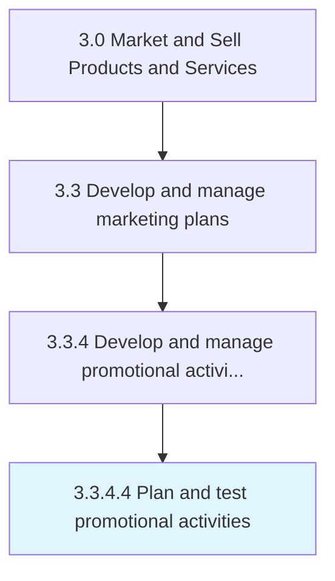
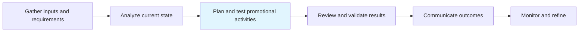

# Plan and test promotional activities

> Developing a scheme for executing the promotional programs and campaigns, and testing these on sample audiences.

## Overview

Activity 3.3.4.4 is an activity within the Market and Sell Products and Services framework.

Developing a scheme for executing the promotional programs and campaigns, and testing these on sample audiences. Create a program plan, and carry out trials for promotional activities. Develop a scheme for how, when, where, and by whom the promotional schemes and campaigns will be deployed. Design incentives that convince or tempt the consumer to take up the organization's offerings. Conduct focus groups and pilot programs that reach out to a smaller number of people from among the target audiences to validate effectiveness.

This process is critical to effective sales and marketing execution. It ensures that activities are systematically planned, executed, and measured against organizational objectives. When performed effectively, this process drives revenue growth, enhances customer engagement, and strengthens competitive positioning in target markets.

## Process Hierarchy



## Key Statistics

| Metric | Value |
|--------|-------|
| APQC Code | 10168 |
| Hierarchy ID | 3.3.4.4 |
| Level | Activity |
| Parent | [3.3.4](../) |
| Sub-Processes | 0 |

## Process Flow



## GraphDL Semantic Structure

```
plan.AndTestPromotionalActivities
```

| Component | Value | Description |
|-----------|-------|-------------|
| Verb | `plan` | Primary action |
| Object | `and test promotional activities` | Direct object |


## RACI Matrix

| Role | Responsible | Accountable | Consulted | Informed |
|------|:-----------:|:-----------:|:---------:|:--------:|
| Marketing Manager | R |  |  |  |
| CMO / VP Marketing |  | A |  |  |
| Brand Manager |  |  | C |  |
| Sales Manager |  |  | C |  |
| Executive Leadership |  |  |  | I |

## Related Occupations

- [Marketing Managers](/occupations/Management/MarketingManagers)
- [Advertising And Promotions Managers](/occupations/Management/AdvertisingAndPromotionsManagers)
- [Public Relations Specialists](/occupations/Media-and-Communication/PublicRelationsSpecialists)
- [Market Research Analysts](/occupations/Business-and-Financial-Operations/MarketResearchAnalysts)
- [Graphic Designers](/occupations/Arts-Design-Entertainment-Sports-and-Media/GraphicDesigners)

## Related Departments

- [Marketing](/departments/Marketing)
- [Sales](/departments/Sales)
- [Product Management](/departments/ProductManagement)

## Industry Variations

### Retail

In retail, plan and test promotional activities emphasizes seasonal promotions, visual merchandising, in-store experience design, and coordinated omnichannel campaigns.

### Automotive

In automotive, plan and test promotional activities focuses on dealer network coordination, regional marketing programs, and long purchase-cycle nurture strategies.

### Banking

In banking, plan and test promotional activities involves compliance-reviewed communications, branch-level marketing execution, and digital banking promotion strategies.

## KPIs & Metrics

| Metric | Description | Target |
|--------|-------------|--------|
| Campaign ROI | Return on investment for marketing campaigns and promotions | >4:1 |
| Customer Lifetime Value (CLV) | Projected revenue from average customer relationship | >3x CAC |
| Promotion Effectiveness | Incremental revenue generated per promotional dollar spent | >2:1 |
| Budget Utilization | Percentage of marketing budget effectively deployed | >90% |

## Related Concepts

- PromotionalActivities
- PromotionalActivities

---

*Source: APQC PCF 10168 (3.3.4.4) - APQC*
