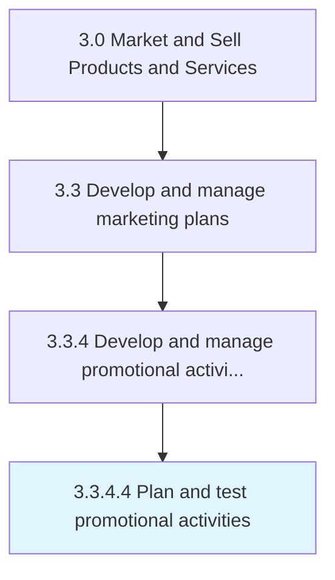

# Plan and test promotional activities

> Developing a scheme for executing the promotional programs and campaigns, and testing these on sample audiences.

## Overview

Activity 3.3.4.4 is an activity within the Market and Sell Products and Services framework. 

Developing a scheme for executing the promotional programs and campaigns, and testing these on sample audiences. Create a program plan, and carry out trials for promotional activities. Develop a scheme for how, when, where, and by whom the promotional schemes and campaigns will be deployed. Design incentives that convince or tempt the consumer to take up the organization's offerings. Conduct focus groups and pilot programs that reach out to a smaller number of people from among the target audiences to validate effectiveness.

## Process Hierarchy



## Key Statistics

| Metric | Value |
|--------|-------|
| APQC Code | 10168 |
| Hierarchy ID | 3.3.4.4 |
| Level | Activity |
| Parent | [3.3.4](../) |
| Sub-Processes | 0 |


## GraphDL Semantic Structure

```
plan.AndTestPromotionalActivities
```

| Component | Value | Description |
|-----------|-------|-------------|
| Verb | `plan` | Primary action |
| Object | `and test promotional activities` | Direct object |


## Related Concepts

- [PromotionalActivities](/concepts/PromotionalActivities)
- [PromotionalActivities](/concepts/PromotionalActivities)


---

*Source: APQC PCF 10168 (3.3.4.4) - APQC*
