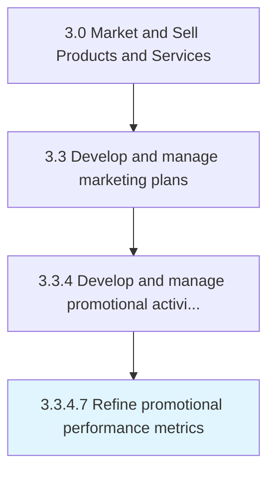

# Refine promotional performance metrics

> Fine-tuning promotional activities by employing the insights gleaned from the quantitative, as well as any qualitative, performance evaluations.

## Overview

Activity 3.3.4.7 is an activity within the Market and Sell Products and Services framework. 

Fine-tuning promotional activities by employing the insights gleaned from the quantitative, as well as any qualitative, performance evaluations. Change certain attributes of the schemes, campaigns, and programs deployed in order to increase the impact generated, in terms of measures already agreed upon such as customer uptake, market penetration, sustenance of impact created, and revenue growth through offerings marketed.

## Process Hierarchy



## Key Statistics

| Metric | Value |
|--------|-------|
| APQC Code | 10171 |
| Hierarchy ID | 3.3.4.7 |
| Level | Activity |
| Parent | [3.3.4](../) |
| Sub-Processes | 0 |


## GraphDL Semantic Structure

```
refine.PromotionalPerformanceMetrics
```

| Component | Value | Description |
|-----------|-------|-------------|
| Verb | `refine` | Primary action |
| Object | `promotional performance metrics` | Direct object |


## Related Concepts

- [PromotionalPerformanceMetrics](/concepts/PromotionalPerformanceMetrics)


---

*Source: APQC PCF 10171 (3.3.4.7) - APQC*
