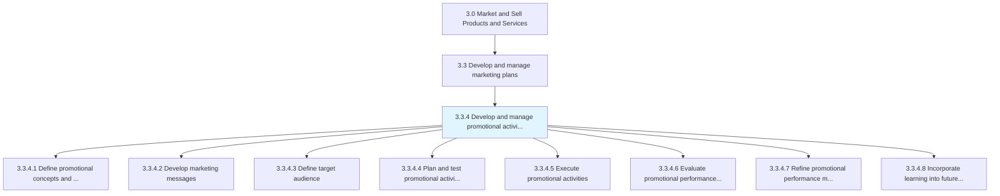
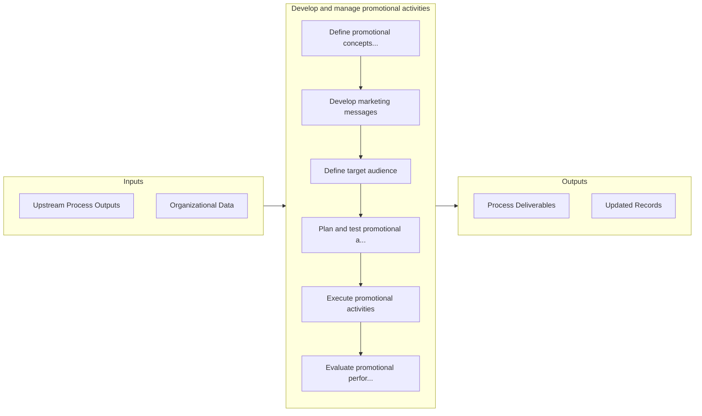

# Develop and manage promotional activities

> Conceptualizing, testing, and executing product/service/brand promotions.

## Overview

Process 3.3.4 is a core process that defines the specific procedures for develop and manage promotional activities. 

Conceptualizing, testing, and executing product/service/brand promotions. Once a promotion has launched, this process continues as the organization tweaks parts of the promotion or chooses to use ideas or lessons learned during the promotion in future activities. The promotion's performance according to organizational measures is also evaluated in this process. Determine early on whether you need third party help with promotion. Purchase lists, consult with social media experts, hire seasonal staff, or pay for additional research.

## Process Hierarchy



## Key Statistics

| Metric | Value |
|--------|-------|
| APQC Code | 20010 |
| Hierarchy ID | 3.3.4 |
| Level | Process |
| Parent | [3.3](../) |
| Sub-Processes | 8 |


## GraphDL Semantic Structure

```
develop.AndManagePromotionalActivities
```

| Component | Value | Description |
|-----------|-------|-------------|
| Verb | `develop` | Primary action |
| Object | `and manage promotional activities` | Direct object |


## Process Flow



## Sub-Processes

| Process | Hierarchy ID | Description |
|---------|-------------|-------------|
| [Define promotional concepts and objectives](./DefinePromotionalConceptsAndObjectives) | 3.3.4.1 | Outlining a conceptual framework for all promotional activity in order to create an overarching aspi |
| [Develop marketing messages](./DevelopMarketingMessages) | 3.3.4.2 | Developing the central messages for a segment of its customers |
| [Define target audience](./DefineTargetAudience) | 3.3.4.3 | Determining the appropriate audience to direct marketing efforts at |
| [Plan and test promotional activities](./PlanAndTestPromotionalActivities) | 3.3.4.4 | Developing a scheme for executing the promotional programs and campaigns, and testing these on sampl |
| [Execute promotional activities](./ExecutePromotionalActivities) | 3.3.4.5 | Executing promotional programs in the market for reaching out to the desired customer segments |
| [Evaluate promotional performance metrics](./EvaluatePromotionalPerformanceMetrics) | 3.3.4.6 | Evaluating the success of promotional programs through metrics that track the impact of these activi |
| [Refine promotional performance metrics](./RefinePromotionalPerformanceMetrics) | 3.3.4.7 | Fine-tuning promotional activities by employing the insights gleaned from the quantitative, as well  |
| [Incorporate learning into future/planned consumer promotions](./IncorporateLearningIntoFutureplannedConsumerPromotions) | 3.3.4.8 | Incorporating the understanding developed by studying promotional activities as well as refining the |


## Related Concepts

- [PromotionalActivities](/concepts/PromotionalActivities)
- [PromotionalActivities](/concepts/PromotionalActivities)


---

*Source: APQC PCF 20010 (3.3.4) - APQC*
