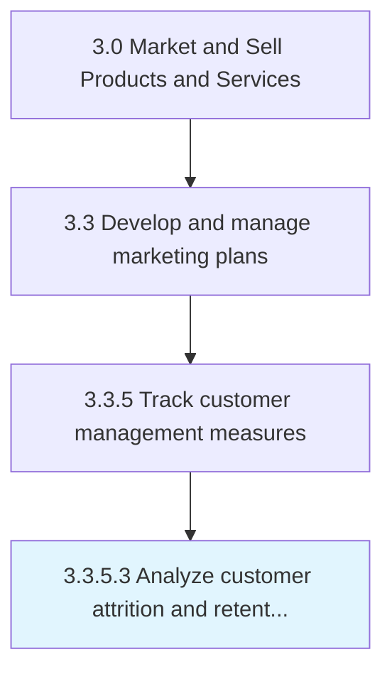

# Analyze customer attrition and retention rates

> Calculating measures that capture the proportion of customers the organization is able to retain to those it is losing.

## Overview

Activity 3.3.5.3 is an activity within the Market and Sell Products and Services framework. 

Calculating measures that capture the proportion of customers the organization is able to retain to those it is losing. Compute metrics such as the tendency to switch brands/providers and the proportion of return customers to comprehend the trends within the customer attrition and retention rates.

## Process Hierarchy



## Key Statistics

| Metric | Value |
|--------|-------|
| APQC Code | 10175 |
| Hierarchy ID | 3.3.5.3 |
| Level | Activity |
| Parent | [3.3.5](../) |
| Sub-Processes | 0 |


## GraphDL Semantic Structure

```
analyze.CustomerAttritionAndRetentionRates
```

| Component | Value | Description |
|-----------|-------|-------------|
| Verb | `analyze` | Primary action |
| Object | `customer attrition and retention rates` | Direct object |


## Related Concepts

- CustomerAttritionRates
- RetentionRates


---

*Source: APQC PCF 10175 (3.3.5.3) - APQC*
