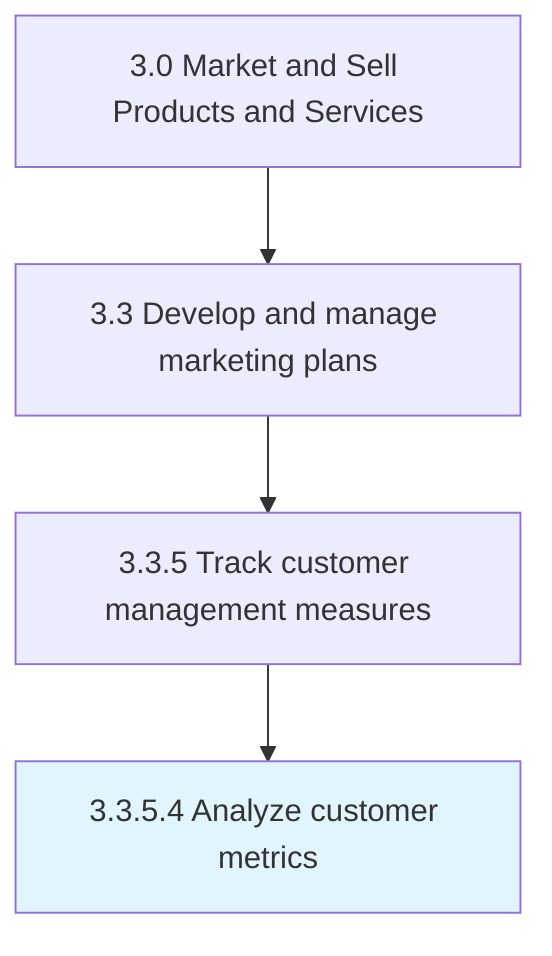
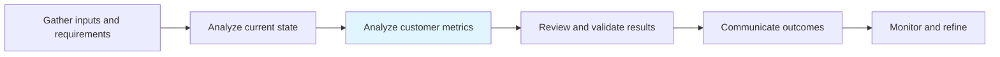

# Analyze customer metrics

> Studying all measures of the customer's behavior and conduct toward the organization's offerings in order to glean insight and identify patterns into their decision making.

## Overview

Activity 3.3.5.4 is an activity within the Market and Sell Products and Services framework.

Studying all measures of the customer's behavior and conduct toward the organization's offerings in order to glean insight and identify patterns into their decision making. Closely examine all categories of data sets over a customer base. Analyze data points related to customer loyalty, retention, value, conversion, level of satisfaction, attrition, etc. Flesh out measures for an all-encompassing analysis that provides a macro-level picture of the customer's behavior and mindset related to the organization's products/services.

This process is critical to effective sales and marketing execution. It ensures that activities are systematically planned, executed, and measured against organizational objectives. When performed effectively, this process drives revenue growth, enhances customer engagement, and strengthens competitive positioning in target markets.

## Process Hierarchy



## Key Statistics

| Metric | Value |
|--------|-------|
| APQC Code | 10176 |
| Hierarchy ID | 3.3.5.4 |
| Level | Activity |
| Parent | [3.3.5](../) |
| Sub-Processes | 0 |

## Process Flow



## GraphDL Semantic Structure

```
analyze.CustomerMetrics
```

| Component | Value | Description |
|-----------|-------|-------------|
| Verb | `analyze` | Primary action |
| Object | `customer metrics` | Direct object |


## RACI Matrix

| Role | Responsible | Accountable | Consulted | Informed |
|------|:-----------:|:-----------:|:---------:|:--------:|
| Marketing Manager | R |  |  |  |
| CMO / VP Marketing |  | A |  |  |
| Brand Manager |  |  | C |  |
| Sales Manager |  |  | C |  |
| Executive Leadership |  |  |  | I |

## Related Occupations

- [Marketing Managers](/occupations/Management/MarketingManagers)
- [Advertising And Promotions Managers](/occupations/Management/AdvertisingAndPromotionsManagers)
- [Public Relations Specialists](/occupations/Media-and-Communication/PublicRelationsSpecialists)
- [Market Research Analysts](/occupations/Business-and-Financial-Operations/MarketResearchAnalysts)
- [Graphic Designers](/occupations/Arts-Design-Entertainment-Sports-and-Media/GraphicDesigners)

## Related Departments

- [Marketing](/departments/Marketing)
- [Sales](/departments/Sales)
- [Product Management](/departments/ProductManagement)

## Industry Variations

### Retail

In retail, analyze customer metrics emphasizes seasonal promotions, visual merchandising, in-store experience design, and coordinated omnichannel campaigns.

### Automotive

In automotive, analyze customer metrics focuses on dealer network coordination, regional marketing programs, and long purchase-cycle nurture strategies.

### Banking

In banking, analyze customer metrics involves compliance-reviewed communications, branch-level marketing execution, and digital banking promotion strategies.

## KPIs & Metrics

| Metric | Description | Target |
|--------|-------------|--------|
| Campaign ROI | Return on investment for marketing campaigns and promotions | >4:1 |
| Customer Lifetime Value (CLV) | Projected revenue from average customer relationship | >3x CAC |
| Promotion Effectiveness | Incremental revenue generated per promotional dollar spent | >2:1 |
| Budget Utilization | Percentage of marketing budget effectively deployed | >90% |

## Related Concepts

- CustomerMetrics

---

*Source: APQC PCF 10176 (3.3.5.4) - APQC*
