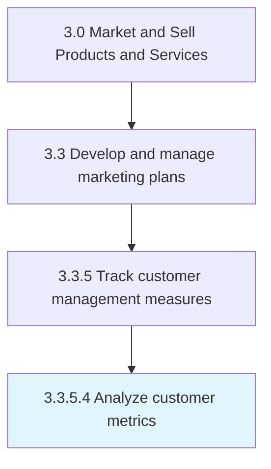

# Analyze customer metrics

> Studying all measures of the customer's behavior and conduct toward the organization's offerings in order to glean insight and identify patterns into their decision making.

## Overview

Activity 3.3.5.4 is an activity within the Market and Sell Products and Services framework. 

Studying all measures of the customer's behavior and conduct toward the organization's offerings in order to glean insight and identify patterns into their decision making. Closely examine all categories of data sets over a customer base. Analyze data points related to customer loyalty, retention, value, conversion, level of satisfaction, attrition, etc. Flesh out measures for an all-encompassing analysis that provides a macro-level picture of the customer's behavior and mindset related to the organization's products/services.

## Process Hierarchy



## Key Statistics

| Metric | Value |
|--------|-------|
| APQC Code | 10176 |
| Hierarchy ID | 3.3.5.4 |
| Level | Activity |
| Parent | [3.3.5](../) |
| Sub-Processes | 0 |


## GraphDL Semantic Structure

```
analyze.CustomerMetrics
```

| Component | Value | Description |
|-----------|-------|-------------|
| Verb | `analyze` | Primary action |
| Object | `customer metrics` | Direct object |


## Related Concepts

- [CustomerMetrics](/concepts/CustomerMetrics)


---

*Source: APQC PCF 10176 (3.3.5.4) - APQC*
