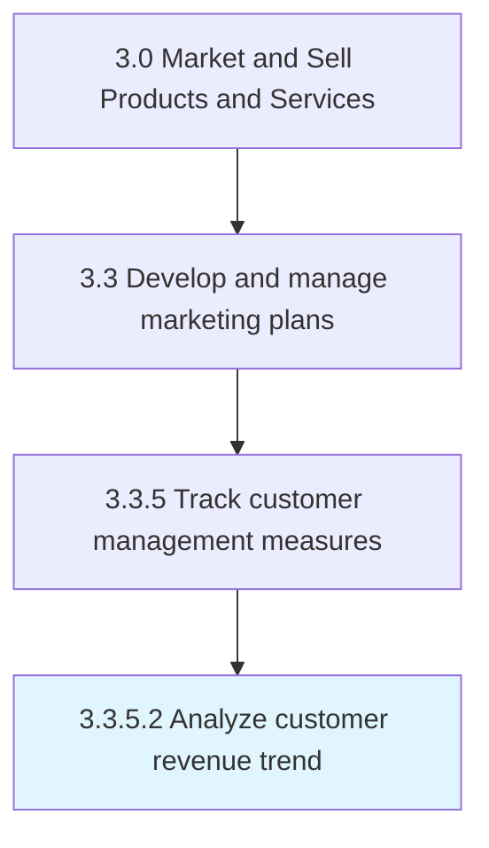

# Analyze customer revenue trend

> Analyzing the revenue stream generated by the sale of the organization's products/services in order to identify trends therein.

## Overview

Activity 3.3.5.2 is an activity within the Market and Sell Products and Services framework. 

Analyzing the revenue stream generated by the sale of the organization's products/services in order to identify trends therein. Examine data relating to the inflow of revenue from individual/groups of customers in order to identify patterns in the generation and sustenance of receivables. Conduct statistical analysis over the stream of revenue collected and the point of origin associated with each unit of sale through metrics such as the accounting rate of return, the GAAP revenue over a given period, and customer lifetime revenue.

## Process Hierarchy



## Key Statistics

| Metric | Value |
|--------|-------|
| APQC Code | 10174 |
| Hierarchy ID | 3.3.5.2 |
| Level | Activity |
| Parent | [3.3.5](../) |
| Sub-Processes | 0 |


## GraphDL Semantic Structure

```
analyze.CustomerRevenueTrend
```

| Component | Value | Description |
|-----------|-------|-------------|
| Verb | `analyze` | Primary action |
| Object | `customer revenue trend` | Direct object |


## Related Concepts

- CustomerRevenueTrend


---

*Source: APQC PCF 10174 (3.3.5.2) - APQC*
