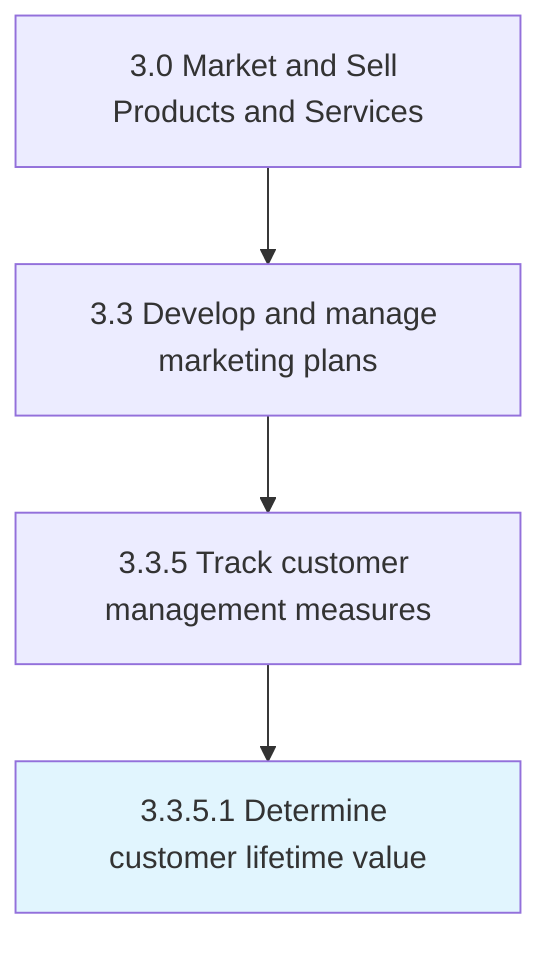

# Determine customer lifetime value

> Estimating customer loyalty and the average contribution made by them to revenues, over their lifespan.

## Overview

Activity 3.3.5.1 is an activity within the Market and Sell Products and Services framework. 

Estimating customer loyalty and the average contribution made by them to revenues, over their lifespan. Use metrics to quantify the commitment of customers to the offerings of the organization, such as measures of tendency to switch brands/providers, number/proportion of return customers, and the number of customers using multiple substitutable offerings.

## Process Hierarchy



## Key Statistics

| Metric | Value |
|--------|-------|
| APQC Code | 10173 |
| Hierarchy ID | 3.3.5.1 |
| Level | Activity |
| Parent | [3.3.5](../) |
| Sub-Processes | 0 |


## GraphDL Semantic Structure

```
determine.CustomerLifetimeValue
```

| Component | Value | Description |
|-----------|-------|-------------|
| Verb | `determine` | Primary action |
| Object | `customer lifetime value` | Direct object |


## Related Concepts

- [CustomerLifetimeValue](/concepts/CustomerLifetimeValue)


---

*Source: APQC PCF 10173 (3.3.5.1) - APQC*
