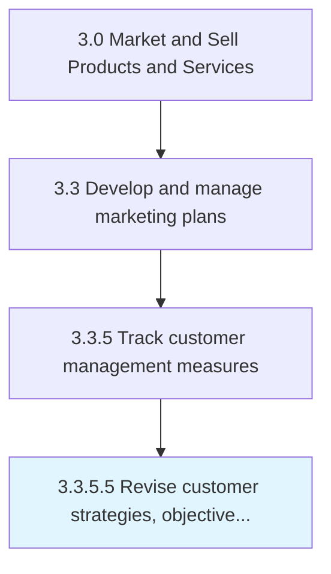
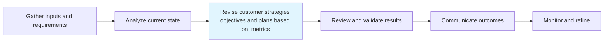

# Revise customer strategies, objectives, and plans based on metrics

> Reviewing and reappraising the strategies, objectives, and plans for all customer-centered processes.

## Overview

Activity 3.3.5.5 is an activity within the Market and Sell Products and Services framework.

Reviewing and reappraising the strategies, objectives, and plans for all customer-centered processes. Revisit all customer-focused processes and activities--which relate to their acquisition, conversion, and retention--with the objective of revising them in light of customer analysis. Revise accordingly.

This process is critical to effective sales and marketing execution. It ensures that activities are systematically planned, executed, and measured against organizational objectives. When performed effectively, this process drives revenue growth, enhances customer engagement, and strengthens competitive positioning in target markets.

## Process Hierarchy



## Key Statistics

| Metric | Value |
|--------|-------|
| APQC Code | 10177 |
| Hierarchy ID | 3.3.5.5 |
| Level | Activity |
| Parent | [3.3.5](../) |
| Sub-Processes | 0 |

## Process Flow



## GraphDL Semantic Structure

```graphdl
revise.CustomerStrategiesObjectivesAndPlansBased.on.Metrics
```

| Component | Value | Description |
|-----------|-------|-------------|
| Verb | `revise` | Primary action |
| Object | `customer strategies, objectives, and plans based` | Direct object |
| Preposition | `on` | Relationship |
| PrepObject | `metrics` | Indirect object |


## RACI Matrix

| Role | Responsible | Accountable | Consulted | Informed |
|------|:-----------:|:-----------:|:---------:|:--------:|
| Marketing Manager | R |  |  |  |
| CMO / VP Marketing |  | A |  |  |
| Brand Manager |  |  | C |  |
| Sales Manager |  |  | C |  |
| Executive Leadership |  |  |  | I |

## Related Occupations

- [Marketing Managers](/occupations/Management/MarketingManagers)
- [Advertising And Promotions Managers](/occupations/Management/AdvertisingAndPromotionsManagers)
- [Public Relations Specialists](/occupations/Media-and-Communication/PublicRelationsSpecialists)
- [Market Research Analysts](/occupations/Business-and-Financial-Operations/MarketResearchAnalysts)
- [Graphic Designers](/occupations/Arts-Design-Entertainment-Sports-and-Media/GraphicDesigners)

## Related Departments

- [Marketing](/departments/Marketing)
- [Sales](/departments/Sales)
- Product Management

## Industry Variations

### Retail

In retail, revise customer strategies, objectives, and plans based on metrics emphasizes seasonal promotions, visual merchandising, in-store experience design, and coordinated omnichannel campaigns.

### Automotive

In automotive, revise customer strategies, objectives, and plans based on metrics focuses on dealer network coordination, regional marketing programs, and long purchase-cycle nurture strategies.

### Banking

In banking, revise customer strategies, objectives, and plans based on metrics involves compliance-reviewed communications, branch-level marketing execution, and digital banking promotion strategies.

## KPIs & Metrics

| Metric | Description | Target |
|--------|-------------|--------|
| Campaign ROI | Return on investment for marketing campaigns and promotions | >4:1 |
| Customer Lifetime Value (CLV) | Projected revenue from average customer relationship | >3x CAC |
| Promotion Effectiveness | Incremental revenue generated per promotional dollar spent | >2:1 |
| Budget Utilization | Percentage of marketing budget effectively deployed | >90% |

## Related Concepts

- CustomerStrategies
- Metrics
- Objectives
- Metrics
- PlansBased
- Metrics

---

*Source: APQC PCF 10177 (3.3.5.5) - APQC*
