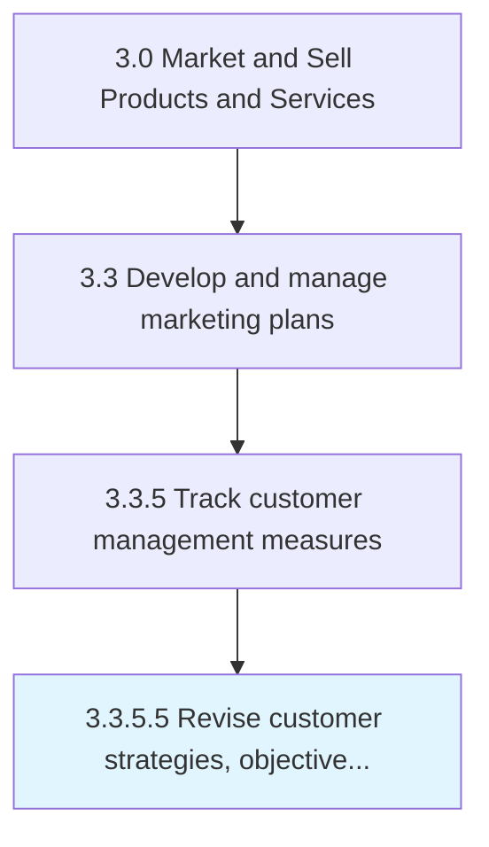

# Revise customer strategies, objectives, and plans based on metrics

> Reviewing and reappraising the strategies, objectives, and plans for all customer-centered processes.

## Overview

Activity 3.3.5.5 is an activity within the Market and Sell Products and Services framework. 

Reviewing and reappraising the strategies, objectives, and plans for all customer-centered processes. Revisit all customer-focused processes and activities--which relate to their acquisition, conversion, and retention--with the objective of revising them in light of customer analysis. Revise accordingly.

## Process Hierarchy



## Key Statistics

| Metric | Value |
|--------|-------|
| APQC Code | 10177 |
| Hierarchy ID | 3.3.5.5 |
| Level | Activity |
| Parent | [3.3.5](../) |
| Sub-Processes | 0 |


## GraphDL Semantic Structure

```
revise.CustomerStrategiesObjectivesAndPlansBased.on.Metrics
```

| Component | Value | Description |
|-----------|-------|-------------|
| Verb | `revise` | Primary action |
| Object | `customer strategies, objectives, and plans based` | Direct object |
| Preposition | `on` | Relationship |
| PrepObject | `metrics` | Indirect object |


## Related Concepts

- [CustomerStrategies](/concepts/CustomerStrategies)
- [Metrics](/concepts/Metrics)
- [Objectives](/concepts/Objectives)
- [Metrics](/concepts/Metrics)
- [PlansBased](/concepts/PlansBased)
- [Metrics](/concepts/Metrics)


---

*Source: APQC PCF 10177 (3.3.5.5) - APQC*
