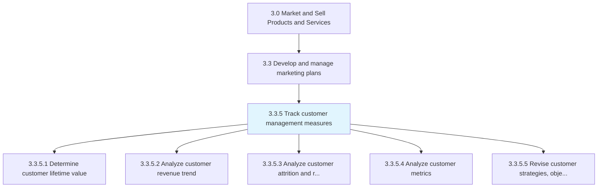
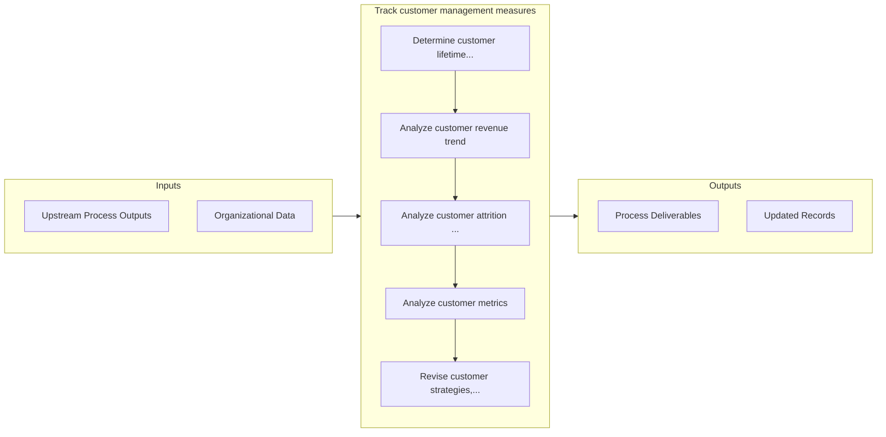

# Track customer management measures

> Collating all customer-centered metrics.

## Overview

Process 3.3.5 is a core process that defines the specific procedures for track customer management measures. 

Collating all customer-centered metrics. The objective is to create a big-picture view of the customers' mindset and their behavior pertaining to the organization's offerings.

## Process Hierarchy



## Key Statistics

| Metric | Value |
|--------|-------|
| APQC Code | 10153 |
| Hierarchy ID | 3.3.5 |
| Level | Process |
| Parent | [3.3](../) |
| Sub-Processes | 5 |


## GraphDL Semantic Structure

```graphdl
track.CustomerManagementMeasures
```

| Component | Value | Description |
|-----------|-------|-------------|
| Verb | `track` | Primary action |
| Object | `customer management measures` | Direct object |


## Process Flow



## Sub-Processes

| Process | Hierarchy ID | Description |
|---------|-------------|-------------|
| [Determine customer lifetime value](./DetermineCustomerLifetimeValue) | 3.3.5.1 | Estimating customer loyalty and the average contribution made by them to revenues, over their lifesp |
| [Analyze customer revenue trend](./AnalyzeCustomerRevenueTrend) | 3.3.5.2 | Analyzing the revenue stream generated by the sale of the organization's products/services in order  |
| [Analyze customer attrition and retention rates](./AnalyzeCustomerAttritionAndRetentionRates) | 3.3.5.3 | Calculating measures that capture the proportion of customers the organization is able to retain to  |
| [Analyze customer metrics](./AnalyzeCustomerMetrics) | 3.3.5.4 | Studying all measures of the customer's behavior and conduct toward the organization's offerings in  |
| [Revise customer strategies, objectives, and plans based on metrics](./ReviseCustomerStrategiesObjectivesAndPlansBasedOnMetrics) | 3.3.5.5 | Reviewing and reappraising the strategies, objectives, and plans for all customer-centered processes |


## Related Concepts

- CustomerManagementMeasures


---

*Source: APQC PCF 10153 (3.3.5) - APQC*
