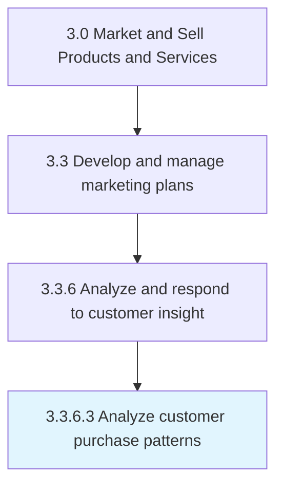

# Analyze customer purchase patterns

> Conducting analyses to uncover customer purchasing habits.

## Overview

Activity 3.3.6.3 is an activity within the Market and Sell Products and Services framework. 

Conducting analyses to uncover customer purchasing habits. Detect patterns and categorize users based on similar characteristics and behaviors, demographic information, geographic location, search history, etc.

## Process Hierarchy



## Key Statistics

| Metric | Value |
|--------|-------|
| APQC Code | 16615 |
| Hierarchy ID | 3.3.6.3 |
| Level | Activity |
| Parent | [3.3.6](../) |
| Sub-Processes | 0 |


## GraphDL Semantic Structure

```
analyze.CustomerPurchasePatterns
```

| Component | Value | Description |
|-----------|-------|-------------|
| Verb | `analyze` | Primary action |
| Object | `customer purchase patterns` | Direct object |


## Related Concepts

- CustomerPurchasePatterns


---

*Source: APQC PCF 16615 (3.3.6.3) - APQC*
