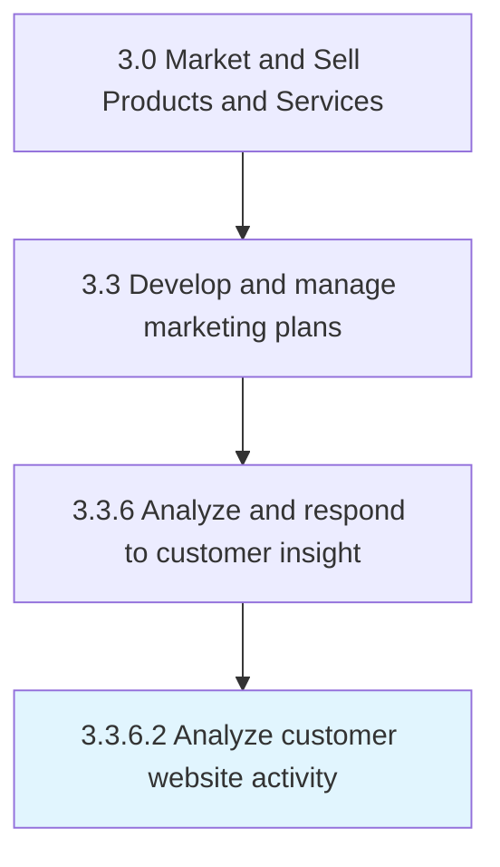

# Analyze customer website activity

> Examining user activity on company, vendor or reseller websites to improve traffic on and to the website, improve user experience on the website to simplify purchasing process and encourage repeat purchases, and to increase the site's visibility in search engine results.

## Overview

Activity 3.3.6.2 is an activity within the Market and Sell Products and Services framework. 

Examining user activity on company, vendor or reseller websites to improve traffic on and to the website, improve user experience on the website to simplify purchasing process and encourage repeat purchases, and to increase the site's visibility in search engine results. Various metrics can be used to measure user activity, such as number of users who are new, returning or unique, time spent on page, session duration, bounce rate, click through rate, conversion rate, and others.

## Process Hierarchy



## Key Statistics

| Metric | Value |
|--------|-------|
| APQC Code | 16614 |
| Hierarchy ID | 3.3.6.2 |
| Level | Activity |
| Parent | [3.3.6](../) |
| Sub-Processes | 0 |


## GraphDL Semantic Structure

```
analyze.CustomerWebsiteActivity
```

| Component | Value | Description |
|-----------|-------|-------------|
| Verb | `analyze` | Primary action |
| Object | `customer website activity` | Direct object |


## Related Concepts

- [CustomerWebsiteActivity](/concepts/CustomerWebsiteActivity)


---

*Source: APQC PCF 16614 (3.3.6.2) - APQC*
