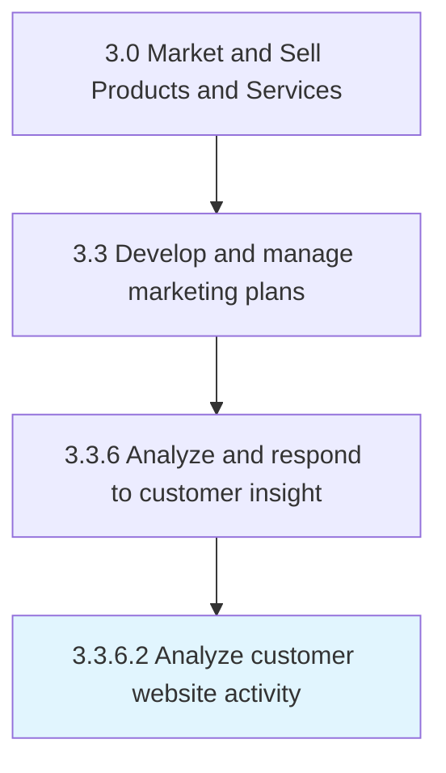
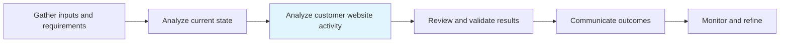

# Analyze customer website activity

> Examining user activity on company, vendor or reseller websites to improve traffic on and to the website, improve user experience on the website to simplify purchasing process and encourage repeat purchases, and to increase the site's visibility in search engine results.

## Overview

Activity 3.3.6.2 is an activity within the Market and Sell Products and Services framework.

Examining user activity on company, vendor or reseller websites to improve traffic on and to the website, improve user experience on the website to simplify purchasing process and encourage repeat purchases, and to increase the site's visibility in search engine results. Various metrics can be used to measure user activity, such as number of users who are new, returning or unique, time spent on page, session duration, bounce rate, click through rate, conversion rate, and others.

This process is critical to effective sales and marketing execution. It ensures that activities are systematically planned, executed, and measured against organizational objectives. When performed effectively, this process drives revenue growth, enhances customer engagement, and strengthens competitive positioning in target markets.

## Process Hierarchy



## Key Statistics

| Metric | Value |
|--------|-------|
| APQC Code | 16614 |
| Hierarchy ID | 3.3.6.2 |
| Level | Activity |
| Parent | [3.3.6](../) |
| Sub-Processes | 0 |

## Process Flow



## GraphDL Semantic Structure

```
analyze.CustomerWebsiteActivity
```

| Component | Value | Description |
|-----------|-------|-------------|
| Verb | `analyze` | Primary action |
| Object | `customer website activity` | Direct object |


## RACI Matrix

| Role | Responsible | Accountable | Consulted | Informed |
|------|:-----------:|:-----------:|:---------:|:--------:|
| Marketing Manager | R |  |  |  |
| CMO / VP Marketing |  | A |  |  |
| Brand Manager |  |  | C |  |
| Sales Manager |  |  | C |  |
| Executive Leadership |  |  |  | I |

## Related Occupations

- [Marketing Managers](/occupations/Management/MarketingManagers)
- [Advertising And Promotions Managers](/occupations/Management/AdvertisingAndPromotionsManagers)
- [Public Relations Specialists](/occupations/Media-and-Communication/PublicRelationsSpecialists)
- [Market Research Analysts](/occupations/Business-and-Financial-Operations/MarketResearchAnalysts)
- [Graphic Designers](/occupations/Arts-Design-Entertainment-Sports-and-Media/GraphicDesigners)

## Related Departments

- [Marketing](/departments/Marketing)
- [Sales](/departments/Sales)
- [Product Management](/departments/ProductManagement)

## Industry Variations

### Retail

In retail, analyze customer website activity emphasizes seasonal promotions, visual merchandising, in-store experience design, and coordinated omnichannel campaigns.

### Automotive

In automotive, analyze customer website activity focuses on dealer network coordination, regional marketing programs, and long purchase-cycle nurture strategies.

### Banking

In banking, analyze customer website activity involves compliance-reviewed communications, branch-level marketing execution, and digital banking promotion strategies.

## KPIs & Metrics

| Metric | Description | Target |
|--------|-------------|--------|
| Campaign ROI | Return on investment for marketing campaigns and promotions | >4:1 |
| Customer Lifetime Value (CLV) | Projected revenue from average customer relationship | >3x CAC |
| Promotion Effectiveness | Incremental revenue generated per promotional dollar spent | >2:1 |
| Budget Utilization | Percentage of marketing budget effectively deployed | >90% |

## Related Concepts

- CustomerWebsiteActivity

---

*Source: APQC PCF 16614 (3.3.6.2) - APQC*
