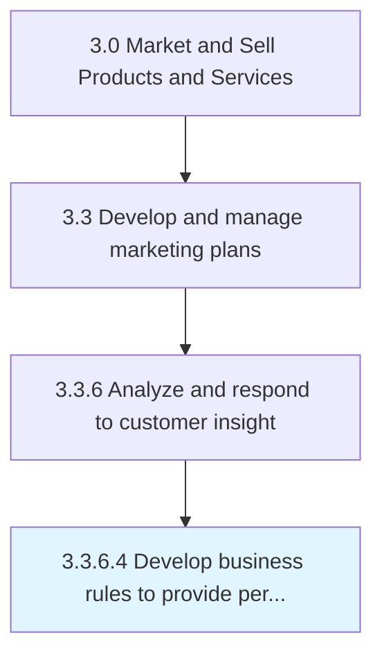

# Develop business rules to provide personalized offers

> Creating formulas for personalized offers, purchasing recommendations and targeted advertisements for customers on the basis of previously detected purchase patterns [16615].

## Overview

Activity 3.3.6.4 is an activity within the Market and Sell Products and Services framework. 

Creating formulas for personalized offers, purchasing recommendations and targeted advertisements for customers on the basis of previously detected purchase patterns [16615].

## Process Hierarchy



## Key Statistics

| Metric | Value |
|--------|-------|
| APQC Code | 16616 |
| Hierarchy ID | 3.3.6.4 |
| Level | Activity |
| Parent | [3.3.6](../) |
| Sub-Processes | 0 |


## GraphDL Semantic Structure

```
develop.BusinessRules.to.ProvidePersonalizedOffers
```

| Component | Value | Description |
|-----------|-------|-------------|
| Verb | `develop` | Primary action |
| Object | `business rules` | Direct object |
| Preposition | `to` | Relationship |
| PrepObject | `provide personalized offers` | Indirect object |


## Related Concepts

- BusinessRules
- ProvidePersonalizedOffers


---

*Source: APQC PCF 16616 (3.3.6.4) - APQC*
