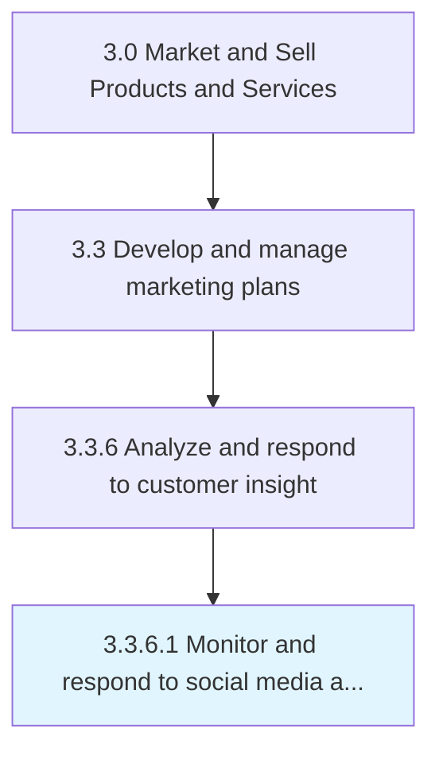

# Monitor and respond to social media activity

> Following postings on social media to promote offerings, raise brand awareness, interact with customers, increase customer engagement and brand loyalty, respond to queries, gauge sentiment regarding company's products or services, and to derive customer insight.

## Overview

Activity 3.3.6.1 is an activity within the Market and Sell Products and Services framework. 

Following postings on social media to promote offerings, raise brand awareness, interact with customers, increase customer engagement and brand loyalty, respond to queries, gauge sentiment regarding company's products or services, and to derive customer insight.

## Process Hierarchy



## Key Statistics

| Metric | Value |
|--------|-------|
| APQC Code | 16627 |
| Hierarchy ID | 3.3.6.1 |
| Level | Activity |
| Parent | [3.3.6](../) |
| Sub-Processes | 0 |


## GraphDL Semantic Structure

```
monitor.AndRespond.to.SocialMediaActivity
```

| Component | Value | Description |
|-----------|-------|-------------|
| Verb | `monitor` | Primary action |
| Object | `and respond` | Direct object |
| Preposition | `to` | Relationship |
| PrepObject | `social media activity` | Indirect object |


## Related Concepts

- SocialMediaActivity
- SocialMediaActivity


---

*Source: APQC PCF 16627 (3.3.6.1) - APQC*
