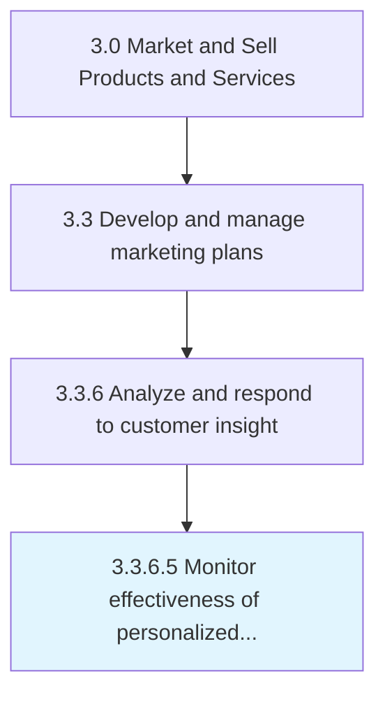

# Monitor effectiveness of personalized offers and adjust offers accordingly

> Analyzing how well the targeted offers perform to see whether they result in an increased conversion rate.

## Overview

Activity 3.3.6.5 is an activity within the Market and Sell Products and Services framework. 

Analyzing how well the targeted offers perform to see whether they result in an increased conversion rate. Reanalyze the purchase patterns or modify those business rules that are produce effective recommendations.

## Process Hierarchy



## Key Statistics

| Metric | Value |
|--------|-------|
| APQC Code | 16617 |
| Hierarchy ID | 3.3.6.5 |
| Level | Activity |
| Parent | [3.3.6](../) |
| Sub-Processes | 0 |


## GraphDL Semantic Structure

```
monitor.Effectiveness.of.PersonalizedOffersAndAdjustOffersAccordingly
```

| Component | Value | Description |
|-----------|-------|-------------|
| Verb | `monitor` | Primary action |
| Object | `effectiveness` | Direct object |
| Preposition | `of` | Relationship |
| PrepObject | `personalized offers and adjust offers accordingly` | Indirect object |


## Related Concepts

- Effectiveness
- PersonalizedOffers
- Effectiveness
- AdjustOffersAccordingly


---

*Source: APQC PCF 16617 (3.3.6.5) - APQC*
