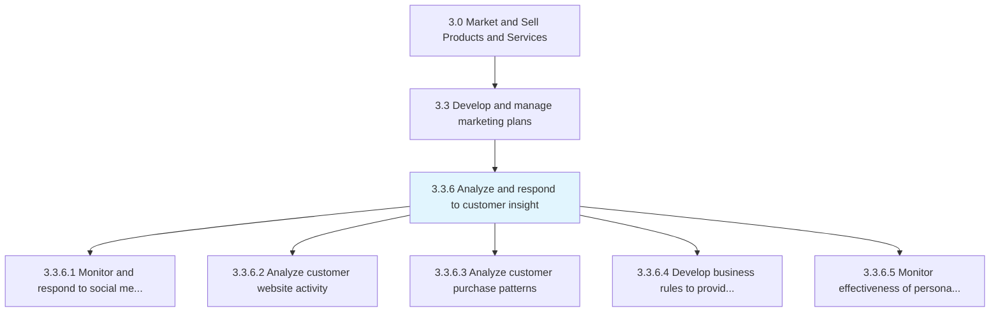
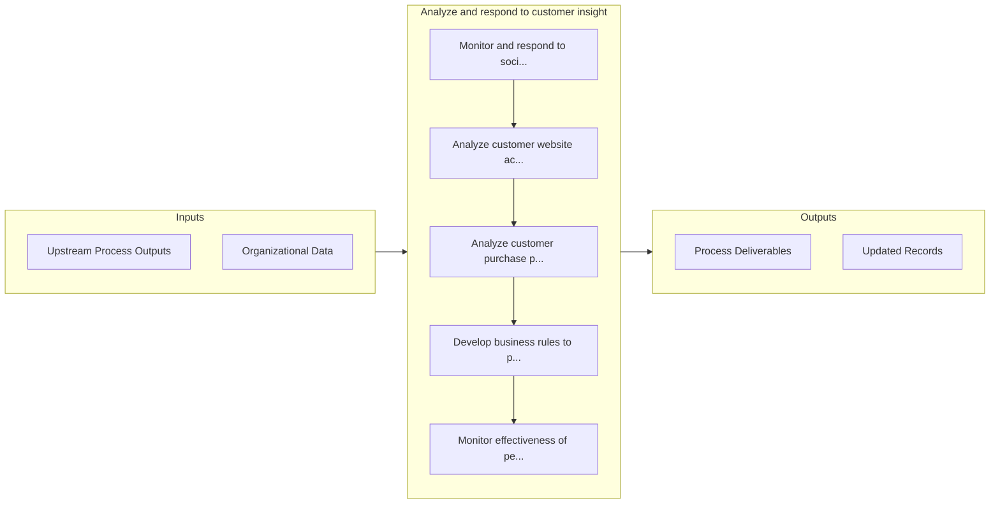

# Analyze and respond to customer insight

> Reviewing and responding to customer feedback.

## Overview

Process 3.3.6 is a core process that defines the specific procedures for analyze and respond to customer insight. 

Reviewing and responding to customer feedback. Create tickets to initiate bug fixes or to propose feature updates. Monitor and track progress.

## Process Hierarchy



## Key Statistics

| Metric | Value |
|--------|-------|
| APQC Code | 16613 |
| Hierarchy ID | 3.3.6 |
| Level | Process |
| Parent | [3.3](../) |
| Sub-Processes | 5 |


## GraphDL Semantic Structure

```
analyze.AndRespond.to.CustomerInsight
```

| Component | Value | Description |
|-----------|-------|-------------|
| Verb | `analyze` | Primary action |
| Object | `and respond` | Direct object |
| Preposition | `to` | Relationship |
| PrepObject | `customer insight` | Indirect object |


## Process Flow



## Sub-Processes

| Process | Hierarchy ID | Description |
|---------|-------------|-------------|
| [Monitor and respond to social media activity](./MonitorAndRespondToSocialMediaActivity) | 3.3.6.1 | Following postings on social media to promote offerings, raise brand awareness, interact with custom |
| [Analyze customer website activity](./AnalyzeCustomerWebsiteActivity) | 3.3.6.2 | Examining user activity on company, vendor or reseller websites to improve traffic on and to the web |
| [Analyze customer purchase patterns](./AnalyzeCustomerPurchasePatterns) | 3.3.6.3 | Conducting analyses to uncover customer purchasing habits |
| [Develop business rules to provide personalized offers](./DevelopBusinessRulesToProvidePersonalizedOffers) | 3.3.6.4 | Creating formulas for personalized offers, purchasing recommendations and targeted advertisements fo |
| [Monitor effectiveness of personalized offers and adjust offers accordingly](./MonitorEffectivenessOfPersonalizedOffersAndAdjustOffersAccordingly) | 3.3.6.5 | Analyzing how well the targeted offers perform to see whether they result in an increased conversion |


## Related Concepts

- CustomerInsight
- CustomerInsight


---

*Source: APQC PCF 16613 (3.3.6) - APQC*
