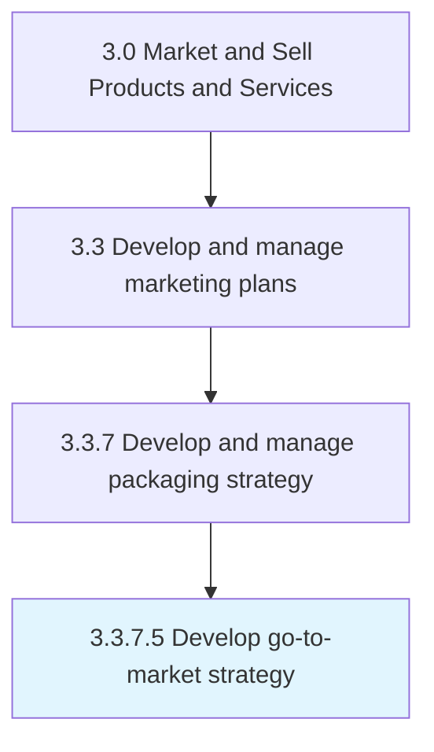

# Develop go-to-market strategy

> Creation of a plan detailing how a company plans to execute a successful product release and promotion, and ultimately its sale to customers.

## Overview

Activity 3.3.7.5 is an activity within the Market and Sell Products and Services framework. 

Creation of a plan detailing how a company plans to execute a successful product release and promotion, and ultimately its sale to customers.

## Process Hierarchy



## Key Statistics

| Metric | Value |
|--------|-------|
| APQC Code | 21425 |
| Hierarchy ID | 3.3.7.5 |
| Level | Activity |
| Parent | [3.3.7](../) |
| Sub-Processes | 0 |


## GraphDL Semantic Structure

```
develop.GotomarketStrategy
```

| Component | Value | Description |
|-----------|-------|-------------|
| Verb | `develop` | Primary action |
| Object | `go-to-market strategy` | Direct object |


---

*Source: APQC PCF 21425 (3.3.7.5) - APQC*
